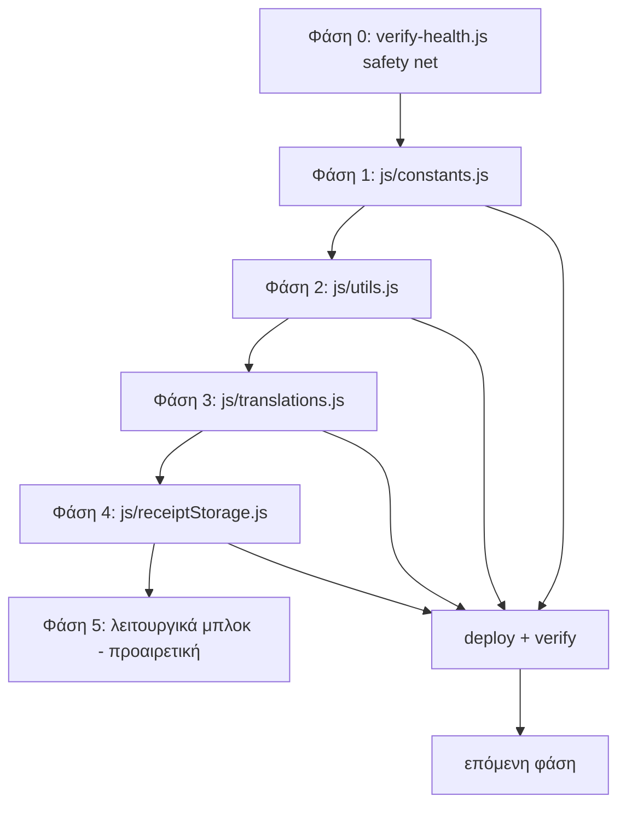

# Πλάνο Νοικοκυρέματος του `app.js` (Modularization)

## Στόχος

Το `app.js` είναι **33.846 γραμμές / 1,44 MB** σε ένα μοναδικό αρχείο. Στόχος είναι να το
χωρίσουμε σε ξεχωριστά, καθαρά, δοκιμάσιμα αρχεία — **χωρίς ρίσκο** και **χωρίς αλλαγή
της αρχιτεκτονικής φόρτωσης** (παραμένουμε σε plain `<script>` tags, ΟΧΙ ES modules).

## Γιατί ΟΧΙ ES modules

Το `app.js` φορτώνεται ως απλό script στο [`index.html:6125`](../index.html:6125)
(`<script src="app.js?v=1327">`). Όλες οι συναρτήσεις μοιράζονται το global scope.
Η μετατροπή σε ES modules (`import`/`export`) θα ήταν **ριζική αλλαγή** που θα έσπαγε
δεκάδες εξαρτήσεις και θα ήταν εξαιρετικά ριψοκίνδυνη για μια εφαρμογή σε παραγωγή.

Αντίθετα, ακολουθούμε το **ήδη αποδεδειγμένο μοτίβο** του [`js/transactionMerge.js`](../js/transactionMerge.js:1):
- UMD wrapper (CommonJS για `node:test` + browser global)
- Φορτώνεται **πριν** το `app.js` μέσω `<script>` tag
- Έχει ήδη test στο [`test/transactionMerge.test.js`](../test/transactionMerge.test.js:1)

## Κρίσιμα γεγονότα που επιβεβαιώθηκαν

| Γεγονός | Πηγή |
|---|---|
| `app.js` = 33.846 γραμμές, φορτώνεται ως plain script | [`index.html:6125`](../index.html:6125) |
| Το `js/` directory αντιγράφεται αυτόματα στο `www/` | [`scripts/version-sync.js:123`](../scripts/version-sync.js:123) |
| Test runner = `node --test "test/**/*.test.js"` | [`package.json:7`](../package.json:7) |
| Το μοτίβο UMD + browser global είναι το πρότυπο | [`js/transactionMerge.js:23`](../js/transactionMerge.js:23) |
| Υπάρχουν ήδη 2 test files | `test/transactionMerge.test.js`, `test/premiumSecurity.test.js` |

## Αρχή λειτουργίας (Safety First)

Κάθε βήμα εξαγωγής πρέπει να είναι **μηδενικού ρίσκου**:

1. **Εξάγουμε ΜΟΝΟ κώδικα χωρίς εξαρτήσεις** από `state`, DOM, Supabase, ή άλλες
   συναρτήσεις του `app.js`.
2. **Δεν αλλάζουμε καθόλου τη λογική** — μόνο μετακίνηση κώδικα (cut-paste) σε νέο αρχείο.
3. **Το νέο αρχείο φορτώνεται πριν το `app.js`** στο `index.html`, ώστε τα globals να
   υπάρχουν όταν τα χρειαστεί το `app.js`.
4. **Κάθε βήμα συνοδεύεται από**: `node --check` + `npm test` + `git commit` + manual
   smoke test πριν το deploy.
5. **Ένα βήμα τη φορά** — ποτέ πολλαπλές εξαγωγές στο ίδιο commit.

## Φάσεις

### Φάση 0 — Safety Net (scripts/verify-health.js)

Δημιουργία ενός **`scripts/verify-health.js`** — ένα **deterministic/static safety gate**
(χωρίς browser automation, χωρίς network) που τρέχει πριν το deploy.

**Συμβατότητα με το πραγματικό pipeline (επιβεβαιώθηκε από επιθεώρηση):**
- Το `release-all.js` και `release-deploy.js` τρέχουν `version-check.js` + `release-verify-live.js`.
- Το `release-verify-live.js` κάνει **live HTTP verification** (network) — το `verify-health.js`
  είναι το **static συμπλήρωμά του** (δεν επικαλύπτεται, δεν απαιτεί network).
- Το `js/` directory αντιγράφεται αυτόματα στο `www/` ([`version-sync.js:123`](../scripts/version-sync.js:123)).
- Το `sw.js` περιέχει λίστα `ASSETS` (γραμμές 4-27) — χρήσιμη πηγή cross-check για τα script dependencies.
- Τα `ota-boot-loader.js` και `js/OTAEngine.js` παράγονται **κατά το release-native** —
  αν απουσιάζουν, ο έλεγχος πρέπει να τα αντιμετωπίζει ως WARN, όχι FAIL.

**Έλεγχοι που θα κάνει (όλοι deterministic/static):**

1. **Syntax check** (`node --check`) σε όλα τα κρίσιμα JS αρχεία:
   - Root: `app.js`, `web-ui.js`, `sw.js`, `xlsx.full.min.js`
   - `js/`: `supabase.js`, `chart.js`, `chartjs-plugin-datalabels.js`, `NLPProcessor.js`,
     `MemoryEngine.js`, `DecisionEngine.js`, `OnlineAIProvider.js`, `AIEngine.js`,
     `IntentCorpus.js`, `KnowledgeGraph.js`, `CurrencyService.js`, `transactionMerge.js`
   - `scripts/`: όλα τα `*.js` (συμπεριλαμβανομένου του ίδιου του `verify-health.js`)
   - `functions/api/`: όλα τα `*.js`
   - Προαιρετικά (WARN αν απουσιάζουν): `ota-boot-loader.js`, `js/OTAEngine.js`

2. **`npm test`** — τρέχει τα υπάρχοντα unit tests (`node --test "test/**/*.test.js"`).

3. **Script dependency/order check** — κάθε `<script src="...">` στο `index.html` πρέπει να
   αντιστοιχεί σε υπαρκτό αρχείο. Επιπλέον cross-check με τη λίστα `ASSETS` του `sw.js`.

4. **Version consistency** — επαναχρησιμοποιεί τη λογική του `version-check.js` (CURRENT_BUILD,
   sw.js SW Version, app.js build number) ώστε να πιάνει ασυνέπειες πριν το deploy.

5. **Balanced braces/backticks sanity** (ελαφρύ static heuristic) — ανιχνεύει προφανή
   σπασμένα μπλοκ σε `app.js`/`index.html` inline scripts χωρίς να απαιτεί browser.

**Έξοδος:** exit code 0 αν όλα περνούν, μη-μηδενικό αν υπάρχουν FAIL. Τα WARN δεν σταματούν.

**Γιατί:** Ο χρήστης έχει βιώσει πολλά σπασίματα με κάθε αλλαγή. Ένα αυτόματο safety net
πιάνει τα περισσότερα πριν φτάσουν στο deploy.

### Φάση 1 — Εξαγωγή Καθαρών Δεδομένων (Constants)

Δημιουργία **`js/constants.js`** με τα εξής (όλα pure data, μηδενικές εξαρτήσεις):

| Σύμβολο | Γραμμές στο app.js | Σημειώσεις |
|---|---|---|
| `CATEGORY_EMOJI_MAP` | 357-389 | pure object |
| `DEFAULT_CATEGORIES` | 392-413 | pure array |
| `DEFAULT_ACCOUNTS` | 416-420 | pure array |
| `NEON_PALETTE` | 665-669 | pure array |
| `GREEK_MONTHS` | 865-867 | pure array |
| `ENGLISH_MONTHS` | 874-877 | pure array |
| `DEFAULT_SUBCATEGORIES_MAP` | 2049-2069 | pure object |
| `CATEGORY_NAME_TRANSLATIONS` | 6711-6740 | pure object |
| `SUBCATEGORY_NAME_TRANSLATIONS` | 6760-6832 | pure object |

**Βήματα:**
1. Δημιουργία `js/constants.js` με UMD wrapper που εκθέτει τα σύμβολα ως
   `window.BAConstants` (browser) και `module.exports` (Node).
2. Αφαίρεση των μπλοκ από το `app.js`.
3. Προσθήκη `<script src="js/constants.js"></script>` **πριν** το `app.js` στο `index.html`.
4. Στο `app.js`, αντικατάσταση των αναφορών με `BAConstants.CATEGORY_EMOJI_MAP` κ.ο.κ.
   (ή διατήρηση global aliases για ελάχιστη αλλαγή — βλ. Σημείωση παρακάτω).

> **Σημείωση για τα globals:** Για να ελαχιστοποιήσουμε τον αριθμό των αλλαγών στο
> `app.js`, μπορούμε στο τέλος του `constants.js` να κάνουμε:
> ```js
> // Browser global aliases (ώστε το app.js να μην αλλάξει καθόλου)
> if (typeof window !== 'undefined') {
>   window.CATEGORY_EMOJI_MAP = BAConstants.CATEGORY_EMOJI_MAP;
>   window.DEFAULT_CATEGORIES = BAConstants.DEFAULT_CATEGORIES;
>   // ... κ.ο.κ.
> }
> ```
> Αυτό κάνει τη Φάση 1 **αμιγώς cut-paste χωρίς καμία αλλαγή λογικής** στο `app.js`.

### Φάση 2 — Εξαγωγή Καθαρών Utilities

Δημιουργία **`js/utils.js`** με καθαρές συναρτήσεις:

| Σύμβολο | Γραμμές | Καθαρό; |
|---|---|---|
| `escapeHtml` | 332-340 | ✅ pure |
| `sanitizeFloat` | 13052-13056 | ✅ pure |
| `getRandomColor` | 13064-13067 | ✅ pure |
| `formatISODateLocal` | 13069-13074 | ✅ pure |
| `formatShortDate` | 13076-13081 | ✅ pure |
| `stripThousandsSeparators` | 2323-2326 | ✅ pure |
| `normalizeString` | 4301-4314 | ✅ pure |
| `normalizeGreekString` | 29920-29928 | ✅ pure |
| `hexToRgb` | 27062-27066 | ✅ pure |
| `generateUUID` | 24021-24030 | ✅ pure |

> **Προσοχή:** `formatCurrency` (13058-13062) διαβάζει `localStorage` — ΔΕΝ είναι πλήρως
> pure. Παραμένει στο `app.js` ή μετακινείται σε ξεχωριστό module με dependency injection.

**Βήματα:** Ίδια με τη Φάση 1 (UMD wrapper, global aliases, `<script>` πριν το `app.js`).

### Φάση 3 — Εξαγωγή `TRANSLATIONS` (μεγαλύτερο όφελος)

Δημιουργία **`js/translations.js`** με το αντικείμενο `TRANSLATIONS` (883-1972, ~1100 γραμμές).

- Είναι pure data (δύο μεγάλα objects `el` και `en`).
- **Μεγαλύτερη μείωση γραμμών** στο `app.js` (~1100 γραμμές).
- Εκθέτουμε ως `window.TRANSLATIONS` (global alias) ώστε το `app.js` να μην αλλάξει.

### Φάση 4 — Εξαγωγή `ReceiptStorage`

Δημιουργία **`js/receiptStorage.js`** με το αντικείμενο `ReceiptStorage` (1978-2042).

- Είναι αυτόνομο (χρησιμοποιεί μόνο `indexedDB`).
- **Προσοχή:** χρησιμοποιεί `indexedDB` (browser-only) — δεν μπορεί να τρέξει σε Node
  χωρίς mock. Γι' αυτό η εξαγωγή γίνεται **μετά** τις Φάσεις 1-3 (που είναι πλήρως testable).
- Εκθέτουμε ως `window.ReceiptStorage` (global alias).

### Φάση 5 — Εξαγωγή Λειτουργικών Μπλοκ (προαιρετική, μεγαλύτερο ρίσκο)

Μετά τις Φάσεις 1-4 (που είναι μηδενικού ρίσκου), μπορούμε να εξετάσουμε εξαγωγή
λειτουργικών μπλοκ που έχουν **ελεγχόμενες εξαρτήσεις**:

- `ReceiptStorage` (αν δεν έγινε στη Φάση 4)
- Currency helpers (20091-20351) — εξαρτώνται από `state`, απαιτούν προσοχή
- Notification helpers (2517-2563) — εξαρτώνται από `state`
- Date/format helpers (2071-2096, 2221-2237)

> **Αυτή η φάση απαιτεί** dependency injection ή προσεκτική μετακίνηση με τα globals
> διαθέσιμα. Γίνεται ΜΟΝΟ αφού οι Φάσεις 1-4 είναι σταθερές και deployed.

## Διάγραμμα Ροής



## Κριτήρια Επιτυχίας ανά Φάση

- [ ] `node --check` περνάει σε όλα τα JS αρχεία
- [ ] `npm test` περνάει (όλα τα unit tests)
- [ ] Το `app.js` δεν έχει αλλάξει λογική (μόνο cut-paste)
- [ ] Τα νέα `<script>` tags είναι πριν το `app.js` στο `index.html`
- [ ] Manual smoke test: η εφαρμογή φορτώνει, login, transactions, settings
- [ ] `git commit` με σαφές μήνυμα
- [ ] Deploy μέσω `npm run release:all` + live verification

## Κίνδυνοι & Μετριασμός

| Κίνδυνος | Μετριασμός |
|---|---|
| Σειρά φόρτωσης scripts | Νέο script πάντα πριν το `app.js` |
| Global name collisions | UMD wrapper + namespaced exports (`BAConstants`, `BAUtils`) |
| `indexedDB` σε Node tests | `ReceiptStorage` εξάγεται σε μεταγενέστερη φάση, χωρίς unit test ή με mock |
| Αλλαγή λογικής κατά το cut-paste | Αυστηρό cut-paste, diff review, `git diff` πριν commit |
| `www/` sync | Το `js/` αντιγράφεται αυτόματα — καμία επιπλέον ενέργεια |

## Εκτιμώμενη Μείωση Γραμμών

| Φάση | Γραμμές που φεύγουν από το app.js |
|---|---|
| Φάση 1 (constants) | ~180 |
| Φάση 2 (utils) | ~60 |
| Φάση 3 (translations) | ~1100 |
| Φάση 4 (receiptStorage) | ~65 |
| **Σύνολο** | **~1400 γραμμές** (~4% του αρχείου) |

> Το πραγματικό όφελος δεν είναι μόνο οι γραμμές — είναι ότι αυτά τα κομμάτια γίνονται
> **δοκιμάσιμα** και **απομονωμένα**, ώστε μελλοντικές αλλαγές να μην τα σπάνε.
