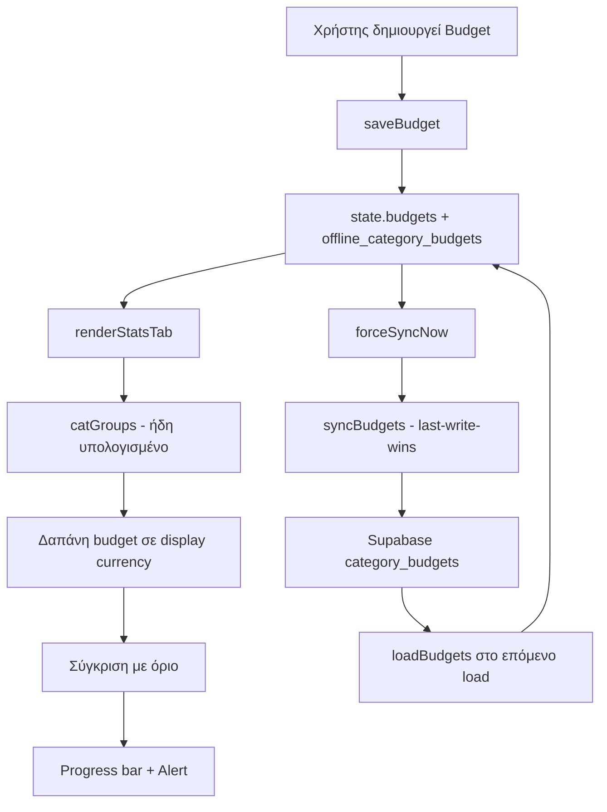

# Architecture Review — Category Budgets

> **Σκοπός**: Τελικός έλεγχος ενσωμάτωσης των Category Budgets στην υπάρχουσα αρχιτεκτονική, πριν την υλοποίηση. Αυτό το έγγραφο **αναθεωρεί** το [`plans/category-budgets-implementation-plan.md`](plans/category-budgets-implementation-plan.md) με βάση τα ευρήματα από τον πραγματικό κώδικα.

---

## 1. Source of Truth — ΚΡΙΣΙΜΟ ΕΥΡΗΜΑ

### Το πρόβλημα στο τρέχον πλάνο

Το τρέχον πλάνο προτείνει να μπουν τα budgets στο **transaction sync queue** (`processSyncQueue()`), δηλαδή να προστεθούν κλάδοι `save_budget`/`delete_budget`. Αυτό δημιουργεί **τρεις πηγές αλήθειας**:

1. `state.budgets` (μνήμη)
2. `localStorage` (`category_budgets`)
3. Supabase (`category_budgets` πίνακας)

Και εισάγει αποκλίσεις: το `processSyncQueue()` κάνει upsert στο cloud αλλά **δεν ενημερώνει** το `state.budgets` ούτε το localStorage — θα χρειαζόταν επιπλέον κώδικας μετά το upsert για να συγχρονιστούν οι τρεις πηγές.

### Το υπάρχον μοτίβο που λύνει το πρόβλημα: Notes

Ο κώδικας έχει **ήδη** ένα entity που λύνει ακριβώς αυτό το πρόβλημα: τα **Notes**. Παρατηρήστε:

- Τα notes **ΔΕΝ** είναι στο κύριο `Promise.all` του `loadData()` (app.js:4091) ούτε του `forceSyncNow()` (app.js:20082).
- Συγχρονίζονται **ξεχωριστά** μέσω `syncNotes()` (app.js:16124), που καλείται στο τέλος του `forceSyncNow()` (app.js:20165).
- Το `syncNotes()` κάνει **last-write-wins με βάση το `updated_at`** (app.js:16160-16168) — όχι sync queue.
- Φορτώνονται από το δικό τους localStorage key `offline_notes` μέσω `loadNotes()` (app.js:15555), που καλείται στο `loadOfflineData()` (app.js:4411).
- Δεν είναι στο realtime subscription — βασίζονται στο `forceSyncNow()` (χειροκίνητο sync, login, tab visibility).

### Απόφαση: Τα budgets ακολουθούν το μοτίβο Notes

**Τα budgets είναι "secondary entity" όπως τα notes, ΟΧΙ μέρος του transaction sync queue.**

Αυτό σημαίνει:
- **Μία πηγή αλήθειας**: το `state.budgets` είναι ο μοναδικός source of truth στο client. Το localStorage (`offline_category_budgets`) είναι **cache** (όπως `offline_notes`), όχι δεύτερη πηγή.
- **Κανένα νέο action στο sync queue** (`save_budget`/`delete_budget` ΔΕΝ προστίθενται στο `processSyncQueue()`). Αυτό αποφεύγει το ρίσκο να πέσουν στο `else` (app.js:19633) και να απορριφθούν σιωπηλά.
- **Συγχρονισμός** μέσω νέας `syncBudgets()` που μιμείται το `syncNotes()`: last-write-wins με `updated_at`, upsert τοπικών → cloud, merge remote → local.
- **Φόρτωση** μέσω `loadBudgets()` στο `loadOfflineData()` (δίπλα στο `loadNotes()` app.js:4411).

### Γιατί είναι πιο σωστό

| Κριτήριο | Sync Queue (παλιό πλάνο) | Μοτίβο Notes (νέο) |
|---|---|---|
| Πηγές αλήθειας | 3 (state + localStorage + cloud) | 1 (state, localStorage=cache) |
| Κίνδυνος απόρριψης action | Υψηλός (else branch app.js:19633) | Μηδενικός |
| Conflict resolution | Δεν ορίζεται | Last-write-wins `updated_at` (όπως notes) |
| Κώδικας που επεκτείνεται | Νέο (processSyncQueue) | Υπάρχον (syncNotes) |
| Τεχνικό χρέος | Νέο | Μηδενικό |

---

## 2. Sync Queue — Απάντηση

**Ερώτημα**: Τα νέα actions ακολουθούν το ίδιο lifecycle;

**Απάντηση**: **Δεν προσθέτουμε actions στο sync queue.** Αυτό είναι το βασικό συμπέρασμα του review. Τα budgets χρησιμοποιούν το μοτίβο `syncNotes()`:

- **Retries**: Το `syncNotes()` δεν έχει retry loop — απλά logάρει σφάλματα (app.js:16203-16206). Το ίδιο κάνουμε για budgets. Ο συγχρονισμός ξαναγίνεται στο επόμενο `forceSyncNow()`.
- **Deduplication**: Δεν χρειάζεται — το upsert είναι idempotent (upsert με `id`).
- **Conflict resolution**: Last-write-wins με `updated_at` (όπως notes app.js:16160-16168).
- **Recovery μετά από offline**: Τα budgets αποθηκεύονται τοπικά στο `state.budgets` + `offline_category_budgets`. Στο επόμενο online sync, το `syncBudgets()` τα ανεβάζει στο cloud.

> **Σημείωση**: Το `syncNotes()` καλείται ΜΟΝΟ μέσα στο `forceSyncNow()` (app.js:20165), όχι στο `loadData()`. Για τα budgets, θα το καλέσουμε και στα δύο (ή τουλάχιστον στο `forceSyncNow()`), ώστε να συγχρονίζονται και στο login/load.

---

## 3. Realtime — Απάντηση

**Ερώτημα**: Τι γίνεται αν δύο συσκευές αλλάξουν το ίδιο budget ταυτόχρονα;

**Απάντηση**: **Last-write-wins αρκεί.** Τα budgets είναι χαμηλής συχνότητας αλλαγών (ένα όριο ανά κατηγορία/μήνα). Δεν χρειάζεται merge — το `updated_at` καθορίζει τον νικητή, όπως στα notes.

**Διπλό render / flickering**: Ο κίνδυνος υπάρχει αν προσθέσουμε realtime subscription για budgets. **Σύσταση: ΜΗΝ προσθέσουμε realtime για budgets στο v1.** Τα notes δεν έχουν realtime και βασίζονται στο `forceSyncNow()`. Τα budgets θα ακολουθήσουν το ίδιο. Αυτό αποφεύγει:
- Νέο subscription στο `setupSupabaseRealtimeSubscription()` (app.js:19671)
- Νέο handler με debounce (το `_realtimeDebounceTimer` app.js:19736 είναι για transactions)
- Κίνδυνο flickering (το polling είναι ήδη disabled, app.js:20242-20251)

Αν αργότερα χρειαστεί live family sync για budgets, μπορεί να προστεθεί με το ίδιο debounce+suppression μοτίβο.

---

## 4. Performance — Απάντηση

**Ερώτημα**: Μήπως επανυπολογίζονται άσκοπα;

**Απάντηση**: Το `renderStatsTab()` (app.js:6054) **ήδη υπολογίζει** το `catGroups` (app.js:6200-6219) — το ακριβές breakdown ανά κατηγορία σε display currency, με μία μόνο διέλευση πάνω στις συναλλαγές.

**Απόφαση**: Τα budgets **ΔΕΝ** κάνουν δικό τους loop πάνω στις συναλλαγές. Αντί για `getCategoryBudgetSpending()` που ξαναδιατρέχει όλες τις συναλλαγές, **αξιοποιούμε το ήδη υπολογισμένο `catGroups`**:

```js
// Μέσα στο renderStatsTab(), μετά τον υπολογισμό του catGroups:
const budgetSpending = catGroups[key] ? catGroups[key].amount : 0;
```

Αυτό σημαίνει:
- **Μηδέν επιπλέον διελεύσεις** πάνω στις συναλλαγές.
- Το `catGroups` υπολογίζεται ήδη σε display currency μέσω `CurrencyService.displayAmount()` (app.js:6212) — άρα το budget πρέπει να συγκρίνεται σε **display currency**, όχι σε `amount_base`.

**Anti-flicker**: Το `renderStatsTab()` έχει signature guard (app.js:6065-6084). Πρέπει να προσθέσουμε τα budgets στο signature (`state.budgets`), ώστε η αλλαγή budget να προκαλεί re-render, αλλά η αλλαγή συναλλαγών να μην ξαναχτίζει άσκοπα τα budgets.

**Memoization**: Δεν χρειάζεται ξεχωριστό cache — το `catGroups` είναι ήδη το memoized αποτέλεσμα της διέλευσης.

---

## 5. Multi-Currency — Απάντηση

**Ερώτημα**: Όλοι οι υπολογισμοί χρησιμοποιούν την ίδια λογική;

**Απάντηση**: **Ναι, με μία σημαντική διόρθωση στο πλάνο.**

Το `renderStatsTab()` αθροίζει σε **display currency** μέσω `CurrencyService.displayAmount(t, displayCurrency)` (app.js:6183, 6212). Άρα:

- Η **δαπάνη** του budget είναι σε **display currency** (από το `catGroups`).
- Το **όριο** του budget πρέπει να αποθηκεύεται σε **display currency** τη στιγμή της δημιουργίας, και να **μετατρέπεται** σε display currency όταν αλλάζει η display currency.

**Διόρθωση στο πλάνο**: Το παλιό πλάνο αποθήκευε `amount_base`/`base_currency`/`rate_to_base` στο budget και υπολόγιζε τη δαπάνη σε base currency. Αυτό **δεν ταιριάζει** με το πώς υπολογίζει τα στατιστικά το app (display currency). 

**Νέο μοντέλο**:
- Το budget αποθηκεύει `amount` + `currency` (το νόμισμα στο οποίο ορίστηκε).
- Για σύγκριση, μετατρέπουμε το `budget.amount` σε display currency μέσω `CurrencyService.convert()` (όχι νέο μηχανισμό).
- Η δαπάνη είναι ήδη σε display currency από το `catGroups`.

```js
// Μετατροπή ορίου budget σε display currency (χρησιμοποιεί το ίδιο CurrencyService)
function getBudgetLimitInDisplay(budget) {
  const displayCurrency = getDisplayCurrency();
  if (budget.currency === displayCurrency) return Number(budget.amount);
  return CurrencyService.convert(Number(budget.amount), budget.currency, displayCurrency, new Date().toISOString().slice(0,10)) || Number(budget.amount);
}
```

> **Κανόνας**: Δεν εισάγουμε δεύτερο μηχανισμό μετατροπής. Χρησιμοποιούμε αποκλειστικά `CurrencyService` (`displayAmount`, `convert`, `toBase`). Το `amount_base` στο budget **δεν χρειάζεται** — αφαιρείται από το schema για απλότητα (η δαπάνη προέρχεται από το `catGroups` που είναι ήδη σε display currency).

---

## 6. Family Mode — Απάντηση

**Ερώτημα**: Τα budgets είναι προσωπικά ή οικογενειακά;

**Απόφαση**: **Υποστηρίζουν και τα δύο, με το ίδιο μοτίβο με τα notes.**

- Κάθε budget έχει `user_id` (δημιουργός) + `family_id` (αν ανήκει σε οικογένεια).
- **Visibility**: Το `syncBudgets()` χρησιμοποιεί το ίδιο `.or()` filter με τα notes (app.js:16132-16136):
  ```js
  if (familyId) {
    query = query.or(`family_id.eq.${familyId},user_id.eq.${userId}`);
  } else {
    query = query.eq('user_id', userId);
  }
  ```
- **RLS**: Ίδιο με τα notes — ο χρήστης βλέπει τα δικά του + της οικογένειας.
- **`is_shared`**: Client-only, αφαιρείται πριν το upsert (όπως app.js:5019).

**Σημείωση για το Stats Tab**: Το `renderStatsTab()` έχει ήδη family member filter (`state.selectedFamilyMemberId`, app.js:6169-6171). Τα budgets πρέπει να σέβονται αυτό το filter — όταν επιλέγεται συγκεκριμένο μέλος, η δαπάνη budget φιλτράρεται σε αυτό το μέλος (όπως γίνεται με το `memberFilteredTrans`).

---

## 7. Future Extensibility — Απάντηση

Το data model σχεδιάζεται ώστε να επεκταθεί χωρίς refactor:

```sql
CREATE TABLE IF NOT EXISTS category_budgets (
  id uuid PRIMARY KEY DEFAULT gen_random_uuid(),
  user_id uuid NOT NULL,
  family_id uuid,
  is_shared boolean NOT NULL DEFAULT false,
  category text NOT NULL,
  subcategory text,              -- (μελλοντικά) budgets ανά υποκατηγορία
  account_id uuid,               -- (μελλοντικά) budgets ανά λογαριασμό
  type text NOT NULL DEFAULT 'expense',
  amount numeric NOT NULL DEFAULT 0,
  currency text NOT NULL DEFAULT 'EUR',
  period text NOT NULL DEFAULT 'monthly',   -- monthly | weekly | annually | custom
  period_start date,             -- (μελλοντικά) custom περίοδος
  rollover boolean NOT NULL DEFAULT false, -- (μελλοντικά) rollover υπολοίπου
  created_at timestamptz NOT NULL DEFAULT now(),
  updated_at timestamptz NOT NULL DEFAULT now()
);
```

- **`period`** (text) επιτρέπει weekly/annual χωρίς αλλαγή schema.
- **`subcategory`/`account_id`** (nullable) επιτρέπουν budgets ανά υποκατηγορία/λογαριασμό.
- **`rollover`** (boolean) επιτρέπει rollover.
- **`family_id`** + `is_shared` επιτρέπουν shared family budgets.

Το `getCurrentBudgetPeriod()` (από το πλάνο) επεκτείνεται εύκολα για weekly/annual με βάση το `period`.

---

## 8. Integration — Απάντηση

**Ερώτημα**: Το feature παρακάμπτει υπάρχοντα patterns;

**Απάντηση**: **Όχι πλέον.** Μετά το review:

| Υπάρχον pattern | Πώς το χρησιμοποιούμε |
|---|---|
| `syncNotes()` (app.js:16124) | Πρότυπο για `syncBudgets()` — last-write-wins, upsert, `.or()` filter |
| `loadNotes()`/`saveNotes()` (app.js:15555/15565) | Πρότυπο για `loadBudgets()`/`saveBudgets()` + `offline_category_budgets` |
| `loadOfflineData()` (app.js:4411) | Προσθήκη `loadBudgets()` δίπλα στο `loadNotes()` |
| `forceSyncNow()` (app.js:20165) | Προσθήκη `await syncBudgets()` δίπλα στο `syncNotes()` |
| `renderStatsTab()` `catGroups` (app.js:6200) | Επαναχρησιμοποίηση για τη δαπάνη budget (μηδέν νέες διελεύσεις) |
| `CurrencyService` | Μόνο αυτός ο μηχανισμός μετατροπής |
| Anti-flicker signature (app.js:6065) | Προσθήκη budgets στο signature |
| `addInAppNotification()` (app.js:2009) | Ειδοποιήσεις υπέρβασης |
| `submitCoachQuery()` context (app.js:23538) | Προσθήκη budgets στο AI context |

**Δεν δημιουργούμε νέο μηχανισμό** — επεκτείνουμε το υπάρχον μοτίβο notes.

---

## 9. Αναθεωρημένο Μοντέλο Δεδομένων (JS)

```js
// state.budgets: []
{
  id: 'uuid',
  user_id: 'uuid',
  family_id: 'uuid | null',
  is_shared: false,          // client-only, αφαιρείται πριν upsert
  category: 'Φαγητό',
  type: 'expense',
  amount: 300,               // όριο σε currency
  currency: 'EUR',           // νόμισμα ορίου
  period: 'monthly',
  created_at: 'ISO',
  updated_at: 'ISO'
}
```

> **Αφαιρέθηκαν** από το παλιό πλάνο: `amount_base`, `base_currency`, `rate_to_base` — δεν χρειάζονται γιατί η δαπάνη προέρχεται από το `catGroups` (ήδη display currency) και το όριο μετατρέπεται μέσω `CurrencyService.convert()`.

---

## 10. Αναθεωρημένες Φάσεις

### Φάση 1 — Migration & RLS
- `category-budgets-migration.sql` (πίνακας + indexes + RLS, χωρίς `amount_base`)

### Φάση 2 — State & Βοηθητικές
- `state.budgets`
- `getCurrentBudgetPeriod()`, `getBudgetLimitInDisplay()`

### Φάση 3 — Τοπική αποθήκευση
- `loadBudgets()`/`saveBudgets()` (πρότυπο notes)
- `loadOfflineData()` → `loadBudgets()`
- Guest mode reset

### Φάση 4 — Cloud sync
- `syncBudgets()` (πρότυπο `syncNotes()`)
- Κλήση στο `forceSyncNow()` (δίπλα στο `syncNotes()` app.js:20165)

### Φάση 5 — CRUD
- `saveBudget()`, `deleteBudget()` (ενημερώνουν state + localStorage + `syncBudgets()`)

### Φάση 6 — UI
- Ενότητα στο `renderStatsTab()` χρησιμοποιώντας το `catGroups`
- Modal δημιουργίας/επεξεργασίας
- Προσθήκη budgets στο anti-flicker signature

### Φάση 7 — Ειδοποιήσεις & AI
- `checkBudgetAlerts()` (μετά την αποθήκευση συναλλαγής)
- Προσθήκη budgets στο context του Advisor

### Φάση 8 — Έλεγχος & Deploy
- `node --check app.js`
- `powershell -ExecutionPolicy Bypass -File build_and_deploy.ps1`

---

## 11. Διάγραμμα Ροής (Αναθεωρημένο)



---

## 12. Συμπέρασμα

Το review αποκάλυψε ότι το **αρχικό πλάνο ήταν υπερβολικά πολύπλοκο**: έβαζε τα budgets στο transaction sync queue (3 πηγές αλήθειας, κίνδυνος απόρριψης action) και δημιουργούσε δικό του loop υπολογισμού δαπάνης.

Η **σωστή αρχιτεκτονική** είναι να αντιμετωπιστούν τα budgets ως **secondary entity όπως τα notes**:
- Μία πηγή αλήθειας (`state.budgets`)
- Last-write-wins sync μέσω `syncBudgets()` (πρότυπο `syncNotes()`)
- Επαναχρησιμοποίηση του `catGroups` για τη δαπάνη (μηδέν νέες διελεύσεις)
- Μόνο `CurrencyService` για μετατροπές
- Χωρίς realtime στο v1 (όπως τα notes)
- Επεκτάσιμο schema για weekly/annual/rollover/υποκατηγορίες

Αυτό ενσωματώνει τα budgets ως **φυσικό κομμάτι** της αρχιτεκτονικής, χωρίς νέο τεχνικό χρέος.
