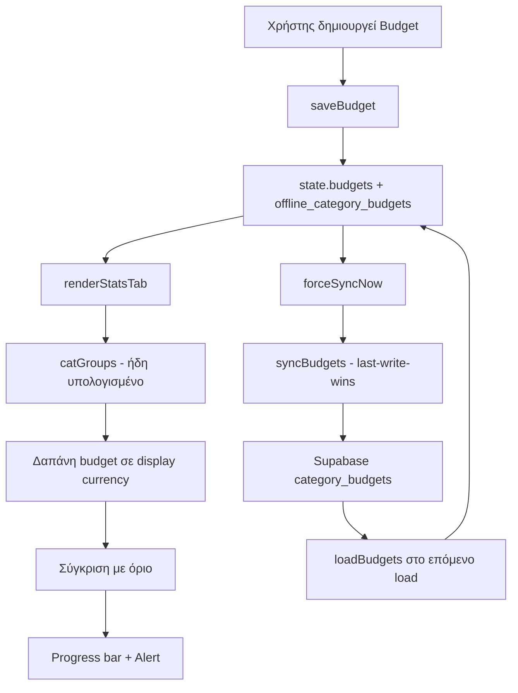

# Πλάνο Υλοποίησης — Προϋπολογισμοί Κατηγοριών (Category Budgets)

> **Σημείωση**: Αυτό είναι το **διορθωμένο** πλάνο. Το αρχικό πλάνο (Gemini v1129) βασιζόταν σε συναρτήσεις/καταστάσεις που **δεν υπάρχουν** στον πραγματικό κώδικα. Μετά το τελικό architecture review, το πλάνο αναθεωρήθηκε περαιτέρω ώστε τα budgets να ακολουθούν το **μοτίβο Notes** (secondary entity) αντί του transaction sync queue. Δείτε το [`plans/category-budgets-architecture-review.md`](plans/category-budgets-architecture-review.md) για την πλήρη ανάλυση.

> **Απόφαση για υποκατηγορίες**: Στο **v1 τα budgets είναι ανά κατηγορία ΜΟΝΟ** (η στήλη `subcategory` μένει `NULL` στο schema για μελλοντική επέκταση). Δείτε την ενότητα 2.4 για την αιτιολόγηση.

---

## 0. Διορθώσεις στο αρχικό πλάνο (Gemini v1129)

| Υπόθεση Gemini | Πραγματικότητα στον κώδικα | Διόρθωση |
|---|---|---|
| `getTransactionsForPeriod()` | **Δεν υπάρχει** | Δεν χρειάζεται — η δαπάνη προέρχεται από το ήδη υπολογισμένο `catGroups` στο `renderStatsTab()` |
| `state.startOfMonthDay` | **Δεν υπάρχει**. Η αρχή μήνα αποθηκεύεται στο `localStorage.getItem('app_month_start')` (default `'1'`) | Ανάγνωση από `localStorage.getItem('app_month_start')` |
| `pullCloudChanges()` | **Δεν υπάρχει**. Ο συγχρονισμός γίνεται μέσω `processSyncQueue()` + `loadData()` / `forceSyncNow()` | Χρήση `syncBudgets()` (πρότυπο `syncNotes()`) |
| Sync queue δέχεται `UPSERT_BUDGET`/`DELETE_BUDGET` | **Όχι**. Το `processSyncQueue()` (app.js:19515) χειρίζεται ΜΟΝΟ `save`, `delete`, `save_template`, `delete_template`. Οποιαδήποτε άλλη ενέργεια πέφτει στο `else` (app.js:19633) και **απορρίπτεται** | **ΔΕΝ προσθέτουμε actions στο sync queue.** Τα budgets συγχρονίζονται μέσω `syncBudgets()` (πρότυπο notes) |
| `getCategoryInfo()` | **Υπάρχει** (app.js:5828) | Σωστό — χρησιμοποιείται ως έχει |
| Νόμισμα: `amount_base`/`base_currency`/`rate_to_base` | **Υπάρχουν** + `CurrencyService` | Η δαπάνη προέρχεται από το `catGroups` (ήδη display currency). Το όριο μετατρέπεται μέσω `CurrencyService.convert()`. Δεν χρειάζεται `amount_base` στο budget |
| Family: `is_shared`, `family_id`, `family_members` | `is_shared`/`family_id` υπάρχουν. `family_members` = `state.familyProfiles` + `state.partnerProfile` | Χρήση `state.familyProfiles`/`state.partnerProfile` |

---

## 1. Στόχος

Προσθήκη **προϋπολογισμών ανά κατηγορία** (μηνιαίο όριο δαπάνης ανά κατηγορία εξόδων), με:
- **Μία πηγή αλήθειας**: `state.budgets` (localStorage = cache, όπως `offline_notes`)
- **Last-write-wins sync** μέσω `syncBudgets()` (πρότυπο `syncNotes()`)
- **Επαναχρησιμοποίηση** του `catGroups` για τη δαπάνη (μηδέν νέες διελεύσεις)
- **Μόνο `CurrencyService`** για μετατροπές
- **Χωρίς realtime** στο v1 (όπως τα notes)
- Family scoping με το ίδιο `.or()` μοτίβο
- UI στην καρτέλα Στατιστικών (Tab 2)
- Ειδοποιήσεις υπέρβασης + ενσωμάτωση με τον AI Advisor

---

## 2. Μοντέλο Δεδομένων

### 2.1 Entity (JS)

```js
// state.budgets: []
{
  id: 'uuid',                    // generateUUID()
  user_id: 'uuid',               // δημιουργός
  family_id: 'uuid | null',      // αν ανήκει σε οικογένεια
  is_shared: false,              // client-only (αφαιρείται πριν το upsert)
  category: 'Φαγητό',            // κανονικοποιημένο όνομα κατηγορίας
  type: 'expense',               // πάντα 'expense' (budget αφορά έξοδα)
  amount: 300,                   // όριο σε currency
  currency: 'EUR',               // νόμισμα ορίου
  period: 'monthly',             // μόνο 'monthly' στο v1
  created_at: 'ISO',
  updated_at: 'ISO'
}
```

> **Αφαιρέθηκαν** από το παλιό πλάνο: `amount_base`, `base_currency`, `rate_to_base` — δεν χρειάζονται γιατί η δαπάνη προέρχεται από το `catGroups` (ήδη display currency) και το όριο μετατρέπεται μέσω `CurrencyService.convert()`.

### 2.2 Πίνακας Supabase `category_budgets`

```sql
CREATE TABLE IF NOT EXISTS category_budgets (
  id uuid PRIMARY KEY DEFAULT gen_random_uuid(),
  user_id uuid NOT NULL,
  family_id uuid,
  is_shared boolean NOT NULL DEFAULT false,
  category text NOT NULL,
  subcategory text,               -- (μελλοντικά) budgets ανά υποκατηγορία
  account_id uuid,                -- (μελλοντικά) budgets ανά λογαριασμό
  type text NOT NULL DEFAULT 'expense',
  amount numeric NOT NULL DEFAULT 0,
  currency text NOT NULL DEFAULT 'EUR',
  period text NOT NULL DEFAULT 'monthly',   -- monthly | weekly | annually | custom
  period_start date,              -- (μελλοντικά) custom περίοδος
  rollover boolean NOT NULL DEFAULT false, -- (μελλοντικά) rollover υπολοίπου
  created_at timestamptz NOT NULL DEFAULT now(),
  updated_at timestamptz NOT NULL DEFAULT now()
);

CREATE INDEX IF NOT EXISTS idx_category_budgets_user
  ON category_budgets (user_id, category);
CREATE INDEX IF NOT EXISTS idx_category_budgets_family
  ON category_budgets (family_id, category);
```

### 2.3 RLS

```sql
ALTER TABLE category_budgets ENABLE ROW LEVEL SECURITY;

-- Ο χρήστης βλέπει/επεξεργάζεται τα δικά του + αυτά της οικογένειας
CREATE POLICY category_budgets_select ON category_budgets
  FOR SELECT USING (
    user_id = auth.uid()
    OR family_id IN (
      SELECT family_id FROM profiles WHERE id = auth.uid() AND family_id IS NOT NULL
    )
  );

CREATE POLICY category_budgets_insert ON category_budgets
  FOR INSERT WITH CHECK (user_id = auth.uid());

CREATE POLICY category_budgets_update ON category_budgets
  FOR UPDATE USING (
    user_id = auth.uid()
    OR family_id IN (
      SELECT family_id FROM profiles WHERE id = auth.uid() AND family_id IS NOT NULL
    )
  );

CREATE POLICY category_budgets_delete ON category_budgets
  FOR DELETE USING (
    user_id = auth.uid()
    OR family_id IN (
      SELECT family_id FROM profiles WHERE id = auth.uid() AND family_id IS NOT NULL
    )
  );
```

> **Σημείωση**: Το `is_shared` είναι **client-only** (όπως και στις συναλλαγές — αφαιρείται πριν το DB upsert, βλ. app.js:5019). Δεν χρησιμοποιείται στο RLS.

### 2.4 Απόφαση για τις Υποκατηγορίες

**Στο v1 τα budgets είναι ανά κατηγορία ΜΟΝΟ.** Η στήλη `subcategory` υπάρχει στο schema αλλά μένει `NULL` — είναι για μελλοντική επέκταση, όχι για το v1.

**Γιατί όχι budgets ανά υποκατηγορία στο v1:**

1. **Δομή του `catGroups`**: Το `renderStatsTab()` οργανώνει τα δεδομένα ως `category → { amount, subcategories: {} }` (app.js:6214-6223). Ένα budget κατηγορίας αθροίζει φυσικά όλες τις υποκατηγορίες της. Budget ανά υποκατηγορία θα χρειαζόταν δεύτερο επίπεδο σύγκρισης και πιο σύνθετο UI — χωρίς όφελος στο v1.

2. **Οι υποκατηγορίες είναι free-text**: Ο χρήστης τις πληκτρολογεί (app.js:837) και μπορεί να τις **μετονομάσει** (app.js:10452) ή να τις **διαγράψει** (app.js:10511) ολικά. Ένα budget ανά υποκατηγορία θα **έσπαγε** όταν μετονομαστεί/διαγραφεί η υποκατηγορία — πρόβλημα ακεραιότητας δεδομένων.

3. **Το breakdown υποκατηγοριών υπάρχει ήδη**: Το Stats Tab δείχνει ήδη την ανάλυση ανά υποκατηγορία μέσα σε κάθε κατηγορία (app.js:6232-6238). Ο χρήστης βλέπει πού ξοδεύει υπερβολικά μέσα σε μια κατηγορία, χωρίς να χρειάζεται ξεχωριστό budget.

**Πώς θα λειτουργήσει στο μέλλον**: Όταν προστεθούν budgets ανά υποκατηγορία, το `catGroups[key].subcategories[subName]` (app.js:6220) είναι ήδη διαθέσιμο — αρκεί να προστεθεί σύγκριση σε αυτό το επίπεδο. Το schema είναι ήδη έτοιμο (στήλη `subcategory`).

---

## 3. State & Βοηθητικές Συναρτήσεις

### 3.1 Προσθήκη στο `state` (app.js:421)

```js
budgets: [],
```

### 3.2 Τοπική αποθήκευση (πρότυπο notes)

```js
// Πρότυπο: loadNotes() (app.js:15555) / saveNotes() (app.js:15565)
function loadBudgets() {
  try {
    const cached = localStorage.getItem('offline_category_budgets');
    state.budgets = cached ? JSON.parse(cached) : [];
  } catch (e) {
    console.error('Failed to parse offline budgets:', e);
    state.budgets = [];
  }
}

function saveBudgets() {
  localStorage.setItem('offline_category_budgets', JSON.stringify(state.budgets));
}
```

### 3.3 Περίοδος μήνα (βάσει `app_month_start`)

```js
// Επιστρέφει { start, end } για τον τρέχοντα μήνα βάσει app_month_start
// Μοτίβο από getStatsDateRange() (app.js:1801)
function getCurrentBudgetPeriod() {
  const monthStartDay = parseInt(localStorage.getItem('app_month_start') || '1', 10);
  const now = new Date();
  let start, end;
  if (monthStartDay === 1) {
    start = new Date(now.getFullYear(), now.getMonth(), 1, 0, 0, 0, 0);
    end = new Date(now.getFullYear(), now.getMonth() + 1, 0, 23, 59, 59, 999);
  } else {
    start = new Date(now.getFullYear(), now.getMonth(), monthStartDay, 0, 0, 0, 0);
    end = new Date(now.getFullYear(), now.getMonth() + 1, monthStartDay - 1, 23, 59, 59, 999);
  }
  return { start, end };
}
```

### 3.4 Μετατροπή ορίου budget σε display currency

```js
// Χρησιμοποιεί ΜΟΝΟ το CurrencyService (όχι νέο μηχανισμό)
function getBudgetLimitInDisplay(budget) {
  const displayCurrency = getDisplayCurrency();
  if (budget.currency === displayCurrency) return Number(budget.amount);
  return CurrencyService.convert(
    Number(budget.amount),
    budget.currency,
    displayCurrency,
    new Date().toISOString().slice(0, 10)
  ) || Number(budget.amount);
}
```

> **Σημείωση**: Η **δαπάνη** του budget ΔΕΝ υπολογίζεται ξεχωριστά — προέρχεται από το ήδη υπολογισμένο `catGroups` στο `renderStatsTab()` (app.js:6200-6219), το οποίο είναι ήδη σε display currency μέσω `CurrencyService.displayAmount()`.

---

## 4. Cloud Sync — `syncBudgets()` (πρότυπο `syncNotes()`)

### 4.1 Η συνάρτηση

```js
// Πρότυπο: syncNotes() (app.js:16124)
async function syncBudgets() {
  if (!state.supabaseClient || !state.currentUser) return;

  const familyId = state.userProfile ? state.userProfile.family_id : null;
  const userId = state.currentUser.id;

  try {
    let query = state.supabaseClient.from('category_budgets').select('*');
    if (familyId) {
      query = query.or(`family_id.eq.${familyId},user_id.eq.${userId}`);
    } else {
      query = query.eq('user_id', userId);
    }

    const { data: remoteBudgets, error } = await query;
    if (error) {
      if (error.code === 'PGRST116' || error.code === '42P01' || error.status === 404) {
        console.log('[BudgetSync] category_budgets table not found. Skipping.');
        return;
      }
      console.warn('[BudgetSync] error fetching remote budgets:', error);
      return;
    }
    if (!remoteBudgets) return;

    const remoteMap = new Map();
    remoteBudgets.forEach(rb => remoteMap.set(rb.id, rb));

    const mergedBudgets = [];
    const budgetsToUpsert = [];

    state.budgets.forEach(localBudget => {
      const remoteBudget = remoteMap.get(localBudget.id);
      if (remoteBudget) {
        const localDate = new Date(localBudget.updated_at || localBudget.created_at || 0);
        const remoteDate = new Date(remoteBudget.updated_at || remoteBudget.created_at || 0);
        // Last-write-wins
        if (localDate > remoteDate) {
          mergedBudgets.push(localBudget);
          budgetsToUpsert.push(localBudget);
        } else {
          mergedBudgets.push(remoteBudget);
        }
        remoteMap.delete(localBudget.id);
      } else {
        mergedBudgets.push(localBudget);
        budgetsToUpsert.push(localBudget);
      }
    });

    remoteMap.forEach(rb => mergedBudgets.push(rb));

    state.budgets = mergedBudgets;
    saveBudgets();
    renderBudgetsUI();

    if (budgetsToUpsert.length > 0) {
      const records = budgetsToUpsert.map(b => ({
        id: b.id,
        user_id: b.user_id === 'offline-user' ? userId : b.user_id,
        family_id: familyId,
        is_shared: !!b.is_shared,
        category: b.category,
        type: b.type || 'expense',
        amount: parseFloat(b.amount || 0),
        currency: b.currency || 'EUR',
        period: b.period || 'monthly',
        created_at: b.created_at || new Date().toISOString(),
        updated_at: b.updated_at || new Date().toISOString()
      }));

      const { error: upsertError } = await state.supabaseClient
        .from('category_budgets')
        .upsert(records);

      if (upsertError) {
        console.warn('[BudgetSync] error pushing local budgets to remote:', upsertError);
      } else {
        console.log(`[BudgetSync] successfully pushed ${records.length} budgets to database.`);
      }
    }
  } catch (err) {
    console.warn('[BudgetSync] unhandled exception during budgets sync:', err);
  }
}
```

### 4.2 Κλήση στο `forceSyncNow()`

Προσθήκη δίπλα στο `syncNotes()` (app.js:20165):

```js
// Sync notes
await syncNotes();
// Sync budgets
await syncBudgets();
```

### 4.3 Φόρτωση στο `loadOfflineData()`

Προσθήκη δίπλα στο `loadNotes()` (app.js:4411):

```js
loadNotes();
loadBudgets();
```

> **Κρίσιμο**: **ΔΕΝ** προσθέτουμε `save_budget`/`delete_budget` στο `processSyncQueue()` (app.js:19515). Αν μπουν, θα πέσουν στο `else` (app.js:19633) και θα **απορριφθούν σιωπηλά** ("Unknown sync queue action, dropping item"). Το `syncBudgets()` με last-write-wins είναι ο σωστός μηχανισμός.

### 4.4 Realtime

**ΔΕΝ προσθέτουμε realtime subscription για budgets στο v1.** Τα notes δεν έχουν realtime και βασίζονται στο `forceSyncNow()`. Τα budgets ακολουθούν το ίδιο. Αυτό αποφεύγει νέο subscription στο `setupSupabaseRealtimeSubscription()` (app.js:19671), νέο handler με debounce, και κίνδυνο flickering.

---

## 5. CRUD Λειτουργίες

### 5.1 Αποθήκευση

```js
async function saveBudget(budget) {
  budget.updated_at = new Date().toISOString();
  // Ενημέρωση τοπικού state (source of truth)
  const idx = state.budgets.findIndex(b => b.id === budget.id);
  if (idx >= 0) state.budgets[idx] = budget; else state.budgets.push(budget);
  saveBudgets();
  renderBudgetsUI();
  // Συγχρονισμός στο cloud (last-write-wins)
  if (state.isSupabaseEnabled && state.supabaseClient && state.currentUser) {
    await syncBudgets();
  }
}
```

### 5.2 Διαγραφή

```js
async function deleteBudget(budgetId) {
  state.budgets = state.budgets.filter(b => b.id !== budgetId);
  saveBudgets();
  renderBudgetsUI();
  // Διαγραφή στο cloud
  if (state.isSupabaseEnabled && state.supabaseClient && state.currentUser) {
    try {
      await state.supabaseClient.from('category_budgets').delete().eq('id', budgetId);
    } catch (err) {
      console.warn('Budget delete cloud error:', err);
    }
  }
}
```

---

## 6. UI — Καρτέλα Στατιστικών (Tab 2)

### 6.1 Τοποθέτηση

Προσθήκη ενότητας "Προϋπολογισμοί" στο `renderStatsTab()` (app.js:6054), πάνω από το breakdown κατηγοριών. Η ενότητα εμφανίζεται μόνο όταν `state.statsPeriodType === 'monthly'` (τα budgets είναι μηνιαία στο v1).

### 6.2 Δαπάνη από το `catGroups` (μηδέν νέες διελεύσεις)

Μέσα στο `renderStatsTab()`, μετά τον υπολογισμό του `catGroups` (app.js:6200-6219):

```js
// Για κάθε budget, η δαπάνη είναι το ήδη υπολογισμένο catGroups[key].amount
const budgetSpending = catGroups[budget.category] ? catGroups[budget.category].amount : 0;
const budgetLimit = getBudgetLimitInDisplay(budget);
const pct = budgetLimit > 0 ? (budgetSpending / budgetLimit) * 100 : 0;
```

### 6.3 Anti-flicker signature

Προσθήκη των budgets στο signature guard (app.js:6065-6079), ώστε η αλλαγή budget να προκαλεί re-render:

```js
const statsSig = [
  // ...υπάρχοντα πεδία...
  (state.budgets || []).map(b => `${b.id}_${b.amount}_${b.currency}_${b.updated_at}`).join('|'),
  // ...
].join('||');
```

### 6.4 Λίστα budgets

Για κάθε budget στο `state.budgets`:
- Όνομα κατηγορίας (μέσω `getCategoryDisplayName()`)
- Δαπάνη (από `catGroups`) / Όριο (σε display currency)
- Progress bar με χρώμα: πράσινο (<80%), πορτοκαλί (80-100%), κόκκινο (>100%)
- Κουμπί επεξεργασίας / διαγραφής

### 6.5 Modal δημιουργίας/επεξεργασίας

- Επιλογή κατηγορίας (από `state.categories` με `type === 'expense'`)
- Πεδίο ποσού ορίου
- Επιλογή νομίσματος (μέσω `openCurrencyPickerModal()`)
- Αποθήκευση → `saveBudget()`

### 6.6 Συνάρτηση render

```js
function renderBudgetsUI() {
  // Ενημερώνει την ενότητα προϋπολογισμών στην καρτέλα στατιστικών
  // Καλείται από renderStatsTab() και μετά από κάθε CRUD
}
```

---

## 7. Ειδοποιήσεις & AI Advisor

### 7.1 Ειδοποίηση υπέρβασης

Στο `checkHighExpenseAlert()` (app.js:4930) ή σε νέα `checkBudgetAlerts()` που καλείται μετά την αποθήκευση συναλλαγής:
- Αν η δαπάνη κατηγορίας ξεπεράσει το όριο → `addInAppNotification()` (app.js:2009) + προαιρετικά `LocalNotifications.schedule()` (όπως το μοτίβο στο app.js:4959)

### 7.2 AI Advisor

Στο `submitCoachQuery()` (app.js:23468), προσθήκη των budgets στο context που στέλνεται στο Gemini (μαζί με `state.transactions`/`state.accounts` στο app.js:23538-23569), ώστε ο advisor να μπορεί να αναφέρεται στους προϋπολογισμούς.

---

## 8. Guest Mode

Στο `loadOfflineData()` (app.js:4301-4316), ο guest mode καθαρίζει όλα τα δεδομένα. Προσθήκη `state.budgets = []` εκεί (δίπλα στο `state.notes = []` app.js:4314). Σε guest mode τα budgets είναι **τοπικά μόνο** (χωρίς sync).

---

## 9. Φάσεις Υλοποίησης

### Φάση 1 — Migration & RLS
- Δημιουργία `category-budgets-migration.sql` (πίνακας + indexes + RLS)
- Εκτέλεση στο Supabase

### Φάση 2 — State & Τοπική αποθήκευση
- Προσθήκη `state.budgets`
- `loadBudgets()`/`saveBudgets()` (πρότυπο notes)
- `getCurrentBudgetPeriod()`, `getBudgetLimitInDisplay()`
- `loadOfflineData()` → `loadBudgets()` + guest reset

### Φάση 3 — Cloud sync
- `syncBudgets()` (πρότυπο `syncNotes()`)
- Κλήση στο `forceSyncNow()` (δίπλα στο `syncNotes()` app.js:20165)

### Φάση 4 — CRUD
- `saveBudget()`, `deleteBudget()`

### Φάση 5 — UI
- Ενότητα προϋπολογισμών στο `renderStatsTab()` χρησιμοποιώντας το `catGroups`
- Προσθήκη budgets στο anti-flicker signature
- Modal δημιουργίας/επεξεργασίας
- `renderBudgetsUI()`

### Φάση 6 — Ειδοποιήσεις & AI
- `checkBudgetAlerts()`
- Προσθήκη budgets στο context του Advisor

### Φάση 7 — Έλεγχος & Deploy
- `node --check app.js`
- `powershell -ExecutionPolicy Bypass -File build_and_deploy.ps1`

---

## 10. Rollback

```sql
DROP TABLE IF EXISTS category_budgets;
```
Αφαίρεση του `state.budgets`, των `loadBudgets()`/`saveBudgets()`/`syncBudgets()` και της ενότητας UI. Μηδενικός αντίκτυπος σε υπάρχουσες λειτουργίες (δεν αγγίζει το `processSyncQueue()`).

---

## 11. Διάγραμμα Ροής


