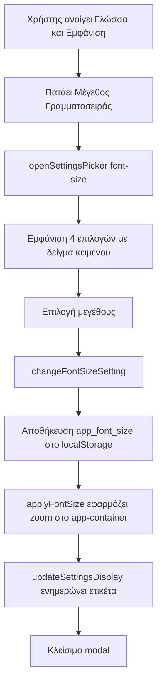

# Σχέδιο: Επιλογή Μεγέθους Γραμματοσειράς στο μενού "Γλώσσα & Εμφάνιση"

## Στόχος
Προσθήκη επιλογής μεγέθους γραμματοσειράς (όπως στα κινητά) στο μενού **Γλώσσα & Εμφάνιση**, ώστε οι χρήστες με δυσκολία ανάγνωσης να μπορούν να μεγαλώσουν το κείμενο της εφαρμογής.

---

## Τρέχουσα κατάσταση (από την εξερεύνηση του κώδικα)

- Το μενού **Γλώσσα & Εμφάνιση** βρίσκεται στο [`index.html`](index.html:1519) (CARD 1) και περιέχει 3 σειρές:
  - **Row 1** Γλώσσα (γραμμή 1540, `id="preferences-lang-row"`)
  - **Row 2** Θέμα Εμφάνισης (γραμμή 1558, `onclick="openSettingsPicker('theme')"`)
  - **Row 3** Νόμισμα εφαρμογής (γραμμή 1576, `onclick="openSettingsPicker('currency')"`)
  - Η νέα σειρά **Row 4** θα προστεθεί **μετά τη γραμμή 1591** (μετά το κλείσιμο του Row 3, πριν το `</div>` στη γραμμή 1592).
- Οι προτιμήσεις αποθηκεύονται σε `localStorage` (π.χ. `app_theme`, `app_lang`, `app_currency`, `app_month_start`, `app_week_start`).
- Το `openSettingsPicker(type)` στο [`app.js`](app.js:18256) ανοίγει το modal `settings-picker-modal` και δημιουργεί δυναμικά τις επιλογές. Υπάρχουν ήδη κλάδοι για `currency`, `theme`, `month-start`, `week-start`, `auto-lock`.
- Το `applyTheme(theme)` στο [`app.js`](app.js:18565) εφαρμόζει το θέμα προσθέτοντας κλάσεις στο `<body>`.
- Το `updateSettingsDisplay()` στο [`app.js`](app.js:18177) ενημερώνει τις ετικέτες εμφάνισης των ρυθμίσεων (π.χ. `settings-theme-display`, `settings-currency-display`).
- Το `initSettingsFromStorage()` στο [`app.js`](app.js:18507) αρχικοποιεί τις ρυθμίσεις κατά την εκκίνηση (καλεί `applyTheme(theme)` στη γραμμή 18547).
- Οι window bindings βρίσκονται στο [`app.js`](app.js:18555) (γραμμές 18556-18562).
- Το βασικό μέγεθος γραμματοσειράς ορίζεται στο [`style.css`](style.css:67) ως `body { font-size: 14px; }`.
- Τα λεξικά i18n βρίσκονται στο [`app.js`](app.js:731): `el` (γραμμές 732-1114) και `en` (γραμμές 1115-1497). Τα κλειδιά `item_*` βρίσκονται: `el` γύρω στη γραμμή 794-806, `en` γύρω στη γραμμή 1177-1189.
- Το `build_and_deploy.ps1` (γραμμές 60-77) αντιγράφει αυτόματα τα root αρχεία (`index.html`, `app.js`, `style.css`) στο `www/` κατά το build.

---

## Προτεινόμενη προσέγγιση

Χρησιμοποιούμε τη CSS ιδιότητα **`zoom`** ως μηχανισμό κλιμάκωσης. Οι περισσότερες τιμές `font-size` στην εφαρμογή είναι σε `px` (όχι `em`/`rem`), οπότε για να μεγαλώσουν **όλα** τα κείμενα ομοιόμορφα, το `zoom` είναι η απλούστερη και πιο αξιόπιστη λύση για κινητά WebView (Capacitor/Chrome/Safari). Κλιμακώνει όλο το UI, συμπεριλαμβανομένων των `px` τιμών.

### ⚠️ Κρίσιμο: Πού εφαρμόζουμε το `zoom` για να μην σπάσουν τα fixed-position modals

**Δομή του layout (επιβεβαιωμένη από τον κώδικα):**
- Το `.app-container` ανοίγει στο [`index.html`](index.html:333) και κλείνει στη γραμμή 4899. **Περιέχει ΟΛΑ** — το κύριο περιεχόμενο (`<main class="app-content">`) **και όλα τα modals** (`.modal-overlay`).
- Το `.app-container` έχει `position: relative; height: 100%; width: 100%; max-width: 480px;` ([`style.css`](style.css:155)).
- Τα modals (`.modal-overlay`) χρησιμοποιούν `position: fixed; top:0; bottom:0; left:0; right:0;` ([`style.css`](style.css:1722)).

**Το πρόβλημα με το `zoom` στο `<body>`:**
Η ιδιότητα `zoom` (όπως και οι `transform`, `filter`, `will-change: transform`) **δημιουργεί νέο containing block** για τα `position: fixed` descendants. Δηλαδή, αν βάλουμε `zoom` στο `<body>`, τότε τα modals με `position: fixed` δεν θα στοιχίζονται πλέον ως προς το **viewport**, αλλά ως προς το **zoomed `<body>`**. Αυτό μπορεί να προκαλέσει:
- Τα modals να μην καλύπτουν πλήρως την οθόνη (να φαίνονται κενά/αποκοπή).
- Λάθος τοποθέτηση (offset) λόγω του scaling.
- Προβλήματα με το `bottom: 0` και το `padding-bottom: var(--keyboard-height)`.

**Η σωστή λύση — `zoom` στο `.app-container` + reset στα modals:**
1. Εφαρμόζουμε `zoom` στο **`.app-container`** (όχι στο `<body>`). Αυτό κλιμακώνει όλο το κύριο περιεχόμενο (header, tabs, λίστες, κάρτες).
2. Προσθέτουμε **`zoom: 1`** σε όλα τα `.modal-overlay`. Αυτό "ακυρώνει" το scaling μέσα στα modals, ώστε το περιεχόμενό τους να εμφανίζεται σε κανονικό μέγεθος.
3. Επειδή το `.app-container` γεμίζει το viewport (`height:100%; width:100%`), τα modals με `position: fixed` (ως προς το zoomed container) θα εξακολουθούν να καλύπτουν σωστά όλη την περιοχή της εφαρμογής.

**Γιατί αυτό είναι ασφαλές:**
- Το κύριο περιεχόμενο μεγαλώνει (ο στόχος του feature).
- Τα modals παραμένουν λειτουργικά και σωστά τοποθετημένα (δεν σπάνε).
- Το `zoom: 1` στα modals είναι μη καταστροφικό — δεν αλλάζει τίποτα όταν το μέγεθος είναι `normal` (1.0).

**Τελικός κώδικας εφαρμογής (αντί του απλού `document.body.style.zoom`):**
```js
function applyFontSize(size) {
  const zoomMap = { small: 0.9, normal: 1.0, large: 1.15, xlarge: 1.3 };
  const zoom = zoomMap[size] || 1.0;
  const appContainer = document.querySelector('.app-container');
  if (appContainer) {
    appContainer.style.zoom = zoom;
  }
}
```
Και στο [`style.css`](style.css:1722), προσθήκη δίπλα στο `.modal-overlay`:
```css
.modal-overlay {
  zoom: 1;
}
```
> **Σημείωση:** Το `zoom: 1` στο `.modal-overlay` είναι απαραίτητο μόνο όταν το `.app-container` έχει `zoom != 1`. Όταν το μέγεθος είναι `normal` (1.0), δεν έχει καμία ορατή επίδραση.

### Επιλογές μεγέθους
| Τιμή | Ετικέτα (el) | Ετικέτα (en) | zoom |
|------|--------------|--------------|------|
| `small` | Μικρό | Small | 0.9 |
| `normal` | Κανονικό | Normal | 1.0 |
| `large` | Μεγάλο | Large | 1.15 |
| `xlarge` | Πολύ Μεγάλο | Extra Large | 1.3 |

- Προεπιλογή: `normal` (1.0) — **καμία αλλαγή** για υπάρχοντες χρήστες.
- Αποθήκευση σε `localStorage` με κλειδί **`app_font_size`**.

---

## Αλλαγές ανά αρχείο (με πλήρη κώδικα)

### 1. [`index.html`](index.html:1591) — Προσθήκη σειράς "Μέγεθος Γραμματοσειράς"

**Πού:** Μετά τη γραμμή 1591 (κλείσιμο Row 3 "Νόμισμα εφαρμογής"), πριν το `</div>` στη γραμμή 1592.

**Νέος κώδικας (Row 4):**
```html
<!-- Row 4: Font Size Select -->
<div class="settings-list-item" onclick="openSettingsPicker('font-size')"
  style="cursor:pointer; padding:14px 16px; display:flex; align-items:center; justify-content:space-between; margin:0;">
  <div style="display:flex; flex-direction:column; gap:3px; flex:1; padding-right:12px;">
    <span class="settings-item-label"
      style="font-weight:700; font-size:14px; color:var(--text-primary);"
      data-i18n="item_font_size">Μέγεθος Γραμματοσειράς</span>
    <span style="font-size:12px; color:var(--text-muted);">Αύξηση μεγέθους κειμένου για ευκολότερη ανάγνωση</span>
  </div>
  <div
    style="display:flex; align-items:center; gap:8px; background:rgba(var(--accent-rgb,124,106,247),0.12); border:1px solid rgba(var(--accent-rgb,124,106,247),0.3); padding:7px 14px; border-radius:20px;">
    <span id="settings-font-size-display"
      style="font-size:13px; font-weight:800; color:var(--accent);">Κανονικό</span>
    <i class="fa-solid fa-chevron-right" style="color:var(--accent); font-size:11px;"></i>
  </div>
</div>
```

> **Σημείωση:** Το Row 3 (Νόμισμα) έχει `margin:0;` χωρίς `border-bottom` (είναι η τελευταία σειρά). Η νέα σειρά Row 4 θα γίνει η τελευταία, οπότε **μετακινούμε το `border-bottom`** από το Row 3 στο Row 4 (ή προσθέτουμε `border-bottom` στο Row 3 και αφήνουμε το Row 4 χωρίς). Σύσταση: προσθέτουμε `border-bottom:1px solid var(--border, rgba(255,255,255,0.05));` στο Row 3 και αφήνουμε το Row 4 χωρίς border-bottom (όπως ήταν το Row 3).

---

### 2. [`app.js`](app.js:18504) — Προσθήκη κλάδου `font-size` στο `openSettingsPicker`

**Πού:** Μέσα στο `openSettingsPicker(type)`, μετά τον κλάδο `auto-lock` (που τελειώνει στη γραμμή 18504), πριν το κλείσιμο της συνάρτησης στη γραμμή 18505.

**Νέος κώδικας:**
```js
if (type === 'font-size') {
  titleEl.textContent = state.lang === 'el' ? 'Μέγεθος Γραμματοσειράς' : 'Font Size';
  const currentVal = localStorage.getItem('app_font_size') || 'normal';

  const options = [
    {
      value: 'small',
      title: state.lang === 'el' ? 'Μικρό' : 'Small',
      sub: state.lang === 'el' ? '0.9x — συμπαγές κείμενο' : '0.9x — compact text',
      icon: 'fa-text-height',
      sample: 12
    },
    {
      value: 'normal',
      title: state.lang === 'el' ? 'Κανονικό' : 'Normal',
      sub: state.lang === 'el' ? '1.0x — προεπιλογή' : '1.0x — default',
      icon: 'fa-text-height',
      sample: 14
    },
    {
      value: 'large',
      title: state.lang === 'el' ? 'Μεγάλο' : 'Large',
      sub: state.lang === 'el' ? '1.15x — μεγαλύτερο κείμενο' : '1.15x — larger text',
      icon: 'fa-text-height',
      sample: 16
    },
    {
      value: 'xlarge',
      title: state.lang === 'el' ? 'Πολύ Μεγάλο' : 'Extra Large',
      sub: state.lang === 'el' ? '1.3x — μέγιστο μέγεθος' : '1.3x — maximum size',
      icon: 'fa-text-height',
      sample: 18
    }
  ];

  options.forEach(opt => {
    const isSelected = opt.value === currentVal;
    const card = document.createElement('div');
    card.className = `settings-card-item ${isSelected ? 'selected' : ''}`;
    card.innerHTML = `
      <div class="settings-card-left">
        <div class="settings-card-icon"><i class="fa-solid ${opt.icon}"></i></div>
        <div class="settings-card-info">
          <div class="settings-card-title">${opt.title}</div>
          <div class="settings-card-sub">${opt.sub}</div>
          <div class="font-size-sample" style="font-size:${opt.sample}px;">${state.lang === 'el' ? 'Δείγμα κειμένου' : 'Sample text'}</div>
        </div>
      </div>
      <i class="fa-solid fa-check settings-card-check"></i>
    `;
    card.onclick = () => {
      changeFontSizeSetting(opt.value);
      closeModal('settings-picker-modal');
    };
    container.appendChild(card);
  });

  openModal('settings-picker-modal');
  return;
}
```

> Αυτό ακολουθεί ακριβώς το υπάρχον pattern των `week-start` (γραμμές 18400-18448) και `auto-lock` (γραμμές 18450-18504) pickers, με την προσθήκη ενός `<div class="font-size-sample">` που δείχνει δείγμα κειμένου στο αντίστοιχο μέγεθος.

---

### 3. [`app.js`](app.js:18634) — Νέες συναρτήσεις `applyFontSize` & `changeFontSizeSetting`

**Πού:** Δίπλα στο `changeThemeSetting` (γραμμή 18634). Προσθέτουμε μετά το τέλος του `changeThemeSetting`.

**Νέος κώδικας:**
```js
function applyFontSize(size) {
  const zoomMap = { small: 0.9, normal: 1.0, large: 1.15, xlarge: 1.3 };
  const zoom = zoomMap[size] || 1.0;
  // Εφαρμόζουμε zoom στο .app-container (ΟΧΙ στο body) για να μην σπάσουν
  // τα fixed-position modals. Τα modals έχουν zoom:1 στο CSS.
  const appContainer = document.querySelector('.app-container');
  if (appContainer) {
    appContainer.style.zoom = zoom;
  }
}

function changeFontSizeSetting(size) {
  localStorage.setItem('app_font_size', size);
  applyFontSize(size);
  updateSettingsDisplay();
}
```

---

### 4. [`app.js`](app.js:18177) — Ενημέρωση `updateSettingsDisplay`

**Πού:** Μέσα στο `updateSettingsDisplay()`. Προσθέτουμε μετά τον κώδικα του `autoLockDisplay` (μετά τη γραμμή 18253, πριν το κλείσιμο στη γραμμή 18254).

**Νέος κώδικας:**
```js
const fontSizeDisplay = document.getElementById('settings-font-size-display');
if (fontSizeDisplay) {
  const fontSize = localStorage.getItem('app_font_size') || 'normal';
  const fontSizeLabels = {
    'small': state.lang === 'el' ? 'Μικρό' : 'Small',
    'normal': state.lang === 'el' ? 'Κανονικό' : 'Normal',
    'large': state.lang === 'el' ? 'Μεγάλο' : 'Large',
    'xlarge': state.lang === 'el' ? 'Πολύ Μεγάλο' : 'Extra Large'
  };
  fontSizeDisplay.textContent = fontSizeLabels[fontSize] || fontSize;
}
```

---

### 5. [`app.js`](app.js:18507) — Ενημέρωση `initSettingsFromStorage`

**Πού:** Μέσα στο `initSettingsFromStorage()`. Προσθέτουμε ανάγνωση του `app_font_size` και κλήση `applyFontSize`. Τοποθετούμε δίπλα στην κλήση `applyTheme(theme)` στη γραμμή 18547.

**Αλλαγή στη γραμμή 18511** (προσθήκη μεταβλητής):
```js
const theme = localStorage.getItem('app_theme') || 'dark';
const fontSize = localStorage.getItem('app_font_size') || 'normal';
```

**Αλλαγή στη γραμμή 18547** (προσθήκη κλήσης):
```js
applyTheme(theme);
applyFontSize(fontSize);
```

---

### 6. [`app.js`](app.js:18555) — Δήλωση window functions

**Πού:** Στο μπλοκ bindings (γραμμές 18556-18562). Προσθέτουμε δύο νέες γραμμές.

**Νέος κώδικας (προσθήκη στο τέλος του μπλοκ):**
```js
window.applyFontSize = applyFontSize;
window.changeFontSizeSetting = changeFontSizeSetting;
```

---

### 7. [`style.css`](style.css:8049) — CSS για τις επιλογές μεγέθους + reset modals

**Αλλαγή Α — Νέες κλάσεις για το picker μεγέθους** (δίπλα στις `.settings-card-item` / `.theme-picker-grid`, γύρω στη γραμμή 7985-8066):
```css
/* Font Size Picker */
.font-size-sample {
  margin-top: 6px;
  font-weight: 600;
  color: var(--text-primary);
  line-height: 1.3;
}
```

> Η κλάση `.settings-card-item`, `.settings-card-left`, `.settings-card-icon`, `.settings-card-info`, `.settings-card-title`, `.settings-card-sub`, `.settings-card-check` **ήδη υπάρχουν** (χρησιμοποιούνται από τα week-start/auto-lock pickers), οπότε δεν χρειάζεται να ξαναγραφούν. Προσθέτουμε μόνο τη νέα `.font-size-sample`.

**Αλλαγή Β — Reset zoom στα modals** (προσθήκη ιδιότητας στο υπάρχον `.modal-overlay` στη γραμμή 1722):
```css
.modal-overlay {
  /* ...υπάρχουσες ιδιότητες... */
  zoom: 1; /* Κρατά τα fixed-position modals σε κανονικό μέγεθος όταν το .app-container έχει zoom */
}
```

> Αυτό είναι **κρίσιμο**: χωρίς `zoom: 1` στα modals, το `zoom` του `.app-container` θα δημιουργούσε νέο containing block και τα modals με `position: fixed` θα τοποθετούνταν λάθος. Με `zoom: 1` στα modals, το περιεχόμενό τους παραμένει σε κανονικό μέγεθος και, επειδή το `.app-container` γεμίζει το viewport, τα modals εξακολουθούν να καλύπτουν σωστά όλη την οθόνη.

---

### 8. Μετάφραση (i18n) — [`app.js`](app.js:794)

**Λεξικό `el`** — προσθήκη μετά τη γραμμή 805 (`item_currency: 'Κύριο Νόμισμα',`):
```js
item_font_size: 'Μέγεθος Γραμματοσειράς',
```

**Λεξικό `en`** — προσθήκη μετά τη γραμμή 1188 (`item_currency: 'Main Currency',`):
```js
item_font_size: 'Font Size',
```

> **Σημείωση:** Το `data-i18n="item_font_size"` στη σειρά του index.html θα μεταφραστεί αυτόματα από το υπάρχον σύστημα i18n (`applyLanguage`). Οι ετικέτες των επιλογών (Μικρό/Κανονικό/Μεγάλο/Πολύ Μεγάλο) ορίζονται δυναμικά στο `openSettingsPicker` με βάση το `state.lang`, οπότε δεν χρειάζονται ξεχωριστά κλειδιά.

---

### 9. Build & www/

Το [`build_and_deploy.ps1`](build_and_deploy.ps1:60) αντιγράφει αυτόματα τα root αρχεία (`index.html`, `app.js`, `style.css`) στο `www/`. Μετά τις αλλαγές, τρέχουμε το build για να ενημερωθεί το `www/` και να γίνει deploy.

---

## Σημειώσεις / Κίνδυνοι

- **Fixed-position modals:** Το πρόβλημα λύνεται με την εφαρμογή `zoom` στο `.app-container` (όχι στο `<body>`) **και** `zoom: 1` στα `.modal-overlay`. Αυτό διασφαλίζει ότι τα modals παραμένουν σωστά τοποθετημένα και σε κανονικό μέγεθος, ενώ το κύριο περιεχόμενο μεγαλώνει.
- **Υποστήριξη `zoom`:** Καλά υποστηριζόμενο σε Chrome/WebView (Capacitor) και Safari. Εναλλακτική λύση αν χρειαστεί: `transform: scale()` με `transform-origin: top center` και προσαρμογή ύψους — αλλά το `zoom` είναι προτιμότερο γιατί διατηρεί το layout flow.
- **Σημείωση για τα modals:** Με το `zoom: 1` στα modals, το περιεχόμενό τους (π.χ. το settings picker) **δεν** μεγαλώνει. Αυτό είναι αποδεκτό και επιθυμητό — ο στόχος είναι η αναγνωσιμότητα του κύριου περιεχομένου. Αν στο μέλλον θέλουμε και τα modals να μεγαλώνουν, μπορούμε να αφαιρέσουμε το `zoom: 1` και να ελεγχθεί η τοποθέτηση.
- **Έλεγχος κατά την υλοποίηση:** Θα ελεγχθούν τα βασικά modals (settings picker, custom date picker, bottom sheets) με μέγεθος `large`/`xlarge` για να επιβεβαιωθεί ότι καλύπτουν σωστά την οθόνη και δεν υπάρχουν κενά/αποκοπές.
- Η αλλαγή είναι **μη καταστροφική**: προεπιλογή `normal` = καμία αλλαγή για υπάρχοντες χρήστες.
- Το `zoom` δεν αποθηκεύεται στο cloud (είναι συσκευή-τοπική προτίμηση, όπως το θέμα), οπότε κάθε συσκευή έχει τη δική της ρύθμιση.

---

## Διάγραμμα Ροής



---

## Σύνοψη αλλαγών

| # | Αρχείο | Γραμμή | Αλλαγή |
|---|--------|--------|--------|
| 1 | `index.html` | ~1591 | Νέα σειρά Row 4 "Μέγεθος Γραμματοσειράς" |
| 2 | `app.js` | ~18504 | Νέος κλάδος `font-size` στο `openSettingsPicker` |
| 3 | `app.js` | ~18634 | Νέες `applyFontSize` & `changeFontSizeSetting` |
| 4 | `app.js` | ~18253 | Ενημέρωση `updateSettingsDisplay` |
| 5 | `app.js` | ~18511, 18547 | Ενημέρωση `initSettingsFromStorage` |
| 6 | `app.js` | ~18562 | Νέες window bindings |
| 7 | `style.css` | ~8049 | Νέα κλάση `.font-size-sample` |
| 8 | `style.css` | ~1722 | Προσθήκη `zoom: 1` στο `.modal-overlay` |
| 9 | `app.js` | ~805, ~1188 | Νέα i18n κλειδιά `item_font_size` (el/en) |
| 10 | `build_and_deploy.ps1` | — | Τρέχουμε build για sync στο `www/` |
