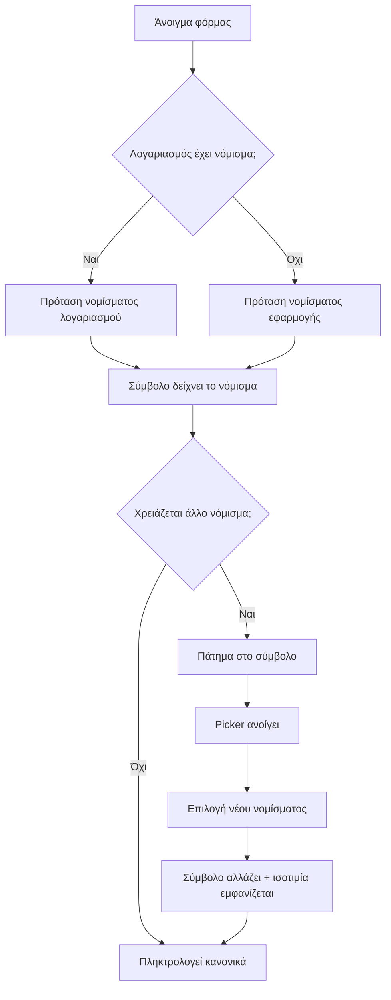

# 🎯 "Αόρατο Multi-Currency" — Πλήρες Πλάνο Υλοποίησης

## Σκοπός
Ο χρήστης **ποτέ δεν ενεργοποιεί** το multi-currency. Η εφαρμογή το υποστηρίζει **πάντα** στο παρασκήνιο. Το μόνο που βλέπει ο χρήστης είναι **το νόμισμα μέσα στο πεδίο του ποσού** — και το αλλάζει μόνο όταν το χρειάζεται (Revolut/Wise/Apple Wallet μοτίβο).

**Κρίσιμη αρχή:** Ο μηχανισμός υπολογισμού (`amount`, `currency`, `rate_to_base`, `base_currency`, `amount_base`) **δεν αλλάζει καθόλου**. Αλλάζει μόνο το UX. Το `CurrencyService` παραμένει ο μοναδικός μηχανισμός μετατροπής.

---

## Τρέχουσα κατάσταση (αναφορά)

| Στοιχείο | Τρέχουσα υλοποίηση |
|---|---|
| Feature flag | [`CurrencyService.isEnabled()`](js/CurrencyService.js:432) — διαβάζει `localStorage.multi_currency_enabled` |
| Σειρά νομίσματος στη φόρμα | [`form-row-currency`](index.html:1078) — κρυφή εκτός αν ενεργοποιηθεί |
| Σύμβολο στο ποσό | [`updateAmountCurrencySymbol()`](app.js:16124) — ορατό **μόνο όταν υπάρχει τιμή** |
| Σειρά "Πραγματική χρέωση" | [`form-row-actual-amount`](index.html:1092) — gate από `isEnabled()` |
| Ρυθμίσεις | 3 items: [`settings-currency`](index.html:1459), [`settings-display-currency`](index.html:1477), [`settings-multi-currency`](index.html:1497) |
| Picker | [`openCurrencyPickerModal()`](app.js:10642) + [`renderCurrencyPickerOptions()`](app.js:10652) — ήδη σωστή ταξινόμηση |
| Display currency | [`getDisplayCurrency()`](app.js:16248) — ξεχωριστή έννοια |
| Net worth ξένων | [`app.js:6727`](app.js:6727) — gate από `isEnabled()` |
| Dual amount (ισοτιμία κάτω από ποσό) | [`updateDualAmountDisplay()`](app.js:16194) — ήδη υπάρχει, gate από `isEnabled()` |

---

## Σχεδιαστικές αποφάσεις

### 1. "Νόμισμα εφαρμογής" = base currency
- Το `app_currency` (base) μετονομάζεται **μόνο στο UI** σε "Νόμισμα εφαρμογής".
- Το display currency **καταργείται ως έννοια**: όλα τα σύνολα εμφανίζονται στο νόμισμα εφαρμογής.
- Το multi-currency είναι **πάντα ενεργό**: `isEnabled()` επιστρέφει πάντα `true`.

### 2. Το νόμισμα ζει μέσα στο πεδίο ποσού
- Το σύμβολο νομίσματος είναι **πάντα ορατό** και **πατητό** (ανοίγει το picker).
- Η σειρά `form-row-currency` **διαγράφεται** από τη φόρμα.
- Η ισοτιμία εμφανίζεται **ζωντανά** κάτω από το ποσό (dual amount) όταν το νόμισμα ≠ νόμισμα εφαρμογής.

### 3. Αυτόματη πρόταση νομίσματος
Προτεραιότητα: **νόμισμα λογαριασμού → νόμισμα εφαρμογής → EUR**. (Ήδη υλοποιημένο στο [`initTransactionCurrency()`](app.js:10744).)

### 4. Recent currencies
Το νόμισμα που χρησιμοποίησε ο χρήστης θυμάται (ήδη υπάρχει `getRecentCurrencies()`/`rememberRecentCurrency()`).

---

## Αλλαγές ανά αρχείο

### A. [`js/CurrencyService.js`](js/CurrencyService.js)

**Στόχος:** Το multi-currency να είναι πάντα ενεργό, χωρίς να σπάσει το self-healing export.

1. **`isEnabled()`** → επιστρέφει πάντα `true`:
   ```js
   isEnabled() {
       return true; // Multi-currency είναι πάντα ενεργό (Invisible Multi-Currency)
   }
   ```
   > ⚠️ Διατηρείται η μέθοδος (δεν αφαιρείται) για να μη σπάσει το self-healing export στο [`app.js:460`](app.js:460) και το `REQUIRED` array.

2. **`setEnabled(val)`** → γίνεται no-op (ή αφαιρείται από το `REQUIRED`). **Σύσταση:** κρατήστε τη μέθοδο ως no-op για να μη σπάσει το export, αλλά αφαιρέστε την από το `REQUIRED` array ώστε να μην είναι υποχρεωτική.

3. **Δεν αλλάζει** τίποτα στον μηχανισμό μετατροπών (`computeAmountBase`, `sumInCurrency`, `getRate`, `correctActualAmount` κ.λπ.).

### B. [`index.html`](index.html) — Φόρμα συναλλαγής

1. **Σειρά ποσού** ([`form-row-amount`](index.html:1067)):
   - Το `<span class="currency-symbol">` γίνεται **πάντα ορατό** και **πατητό**:
     ```html
     <span class="currency-symbol currency-symbol-tappable"
           onclick="event.stopPropagation(); openCurrencyPickerModal();"
           style="font-size:18px; font-weight:600; color:var(--text-secondary,#9aa0b4); cursor:pointer; padding:4px 6px; border-radius:8px;">
     </span>
     ```
   - Προσθήκη `▾` (chevron) δίπλα στο σύμβολο για να φαίνεται ότι είναι πατητό.
   - **Κρίσιμο:** το `onclick` πρέπει να έχει `event.stopPropagation()` ώστε το πάτημα στο σύμβολο να **μην** ανοίγει το πληκτρολόγιο (η σειρά έχει `onclick="openCalculatorKeypad()"`).

2. **Σειρά νομίσματος** ([`form-row-currency`](index.html:1078)) → **διαγράφεται εντελώς** από το HTML.

3. **Σειρά "Πραγματική χρέωση"** ([`form-row-actual-amount`](index.html:1092)) → παραμένει, αλλά το gate αλλάζει (βλ. app.js).

4. **Στοιχείο dual amount** — προστίθεται δομικά στη σειρά ποσού (ή δημιουργείται δυναμικά όπως ήδη γίνεται στο [`updateDualAmountDisplay()`](app.js:16201)).

### C. [`index.html`](index.html) — Ρυθμίσεις

1. **Αντικατάσταση** του [`settings-currency`](index.html:1459) block:
   - Label: **"Νόμισμα εφαρμογής"** (αντί "Κύριο Νόμισμα").
   - Sub-label: *"Το νόμισμα που χρησιμοποιείς συνήθως"*.
   - Το `<select>` αντικαθίσταται από **picker με όλα τα νομίσματα** (150+), όχι μόνο 4. Χρησιμοποιείται το υπάρχον `openSettingsPicker('currency')` που ήδη φορτώνει όλα τα νομίσματα από [`CurrencyService.getCurrencies()`](js/CurrencyService.js:187).

2. **Διαγραφή** του [`settings-row-display-currency`](index.html:1468) block (Νόμισμα Εμφάνισης).

3. **Διαγραφή** του [`settings-row-multi-currency`](index.html:1487) block (toggle Πολλαπλά Νομίσματα).

### D. [`app.js`](app.js) — Λειτουργίες

1. **`syncCurrencyRowVisibility()`** ([`app.js:10736`](app.js:10736)) → **αφαιρείται** (δεν υπάρχει πια σειρά νομίσματος). Αφαιρούνται και οι κλήσεις της.

2. **`updateAmountCurrencySymbol()`** ([`app.js:16124`](app.js:16124)):
   - Αφαιρείται το `span.style.display = hasValue ? 'inline' : 'none'` → το σύμβολο είναι **πάντα ορατό**.
   - Το σύμβολο δείχνει πάντα το τρέχον επιλεγμένο νόμισμα.

3. **`syncActualAmountRowVisibility()`** ([`app.js:10762`](app.js:10762)):
   - Αφαιρείται το gate `CurrencyService.isEnabled() &&` → εμφανίζεται **αυτόματα** όταν `isEdit && txCurrency !== baseCurrency`.

4. **`getDisplayCurrency()`** ([`app.js:16248`](app.js:16248)):
   - Καταργείται/γίνεται ίσο με το νόμισμα εφαρμογής: `return localStorage.getItem('app_currency') || 'EUR';`
   - Όλες οι κλήσεις της (π.χ. [`app.js:6732`](app.js:6732), [`app.js:16087`](app.js:16087)) συνεχίζουν να δουλεύουν, αλλά πλέον επιστρέφουν πάντα το base.

5. **`initMultiCurrency()`** ([`app.js:10794`](app.js:10794)):
   - Το `if (CurrencyService.isEnabled())` στο [`app.js:10824`](app.js:10824) γίνεται πάντα true → φέρνει πάντα τις ισοτιμίες. (Λειτουργικά ίδιο, αφού `isEnabled()` = true.)

6. **`getReliabilityBadge()`** ([`app.js:16166`](app.js:16166)) & **`getTxCurrencyLabel()`** ([`app.js:16184`](app.js:16184)):
   - Αφαιρείται το `if (!CurrencyService.isEnabled()) return '';` → εμφανίζονται πάντα όταν το νόμισμα ≠ base.

7. **`updateDualAmountDisplay()`** ([`app.js:16194`](app.js:16194)):
   - Αφαιρείται το `!CurrencyService.isEnabled() ||` από τη συνθήκη → η ισοτιμία εμφανίζεται πάντα όταν το νόμισμα ≠ base.

8. **Net worth ξένων νομισμάτων** ([`app.js:6727`](app.js:6727)):
   - Αφαιρείται το `CurrencyService.isEnabled() &&` → εμφανίζεται **αυτόματα** όταν υπάρχουν λογαριασμοί σε άλλο νόμισμα.

9. **`updateSettingsDisplay()`** ([`app.js:16341`](app.js:16341)):
   - Αφαιρούνται τα blocks για display currency row/select ([`app.js:16379`](app.js:16379)) και multi-currency checkbox ([`app.js:16541`](app.js:16541)).

10. **`openSettingsPicker()`** ([`app.js:16401`](app.js:16401)):
    - Αφαιρείται ο κλάδος `type === 'display-currency'` ([`app.js:16423`](app.js:16423)).
    - Ο κλάδος `type === 'currency'` μετονομάζεται σε "Νόμισμα εφαρμογής" ([`app.js:16414`](app.js:16414)).

11. **`toggleMultiCurrencySetting()`** & **`changeDisplayCurrencySetting()`** → αφαιρούνται (ή γίνονται no-op).

12. **`initSettingsFromStorage()`** ([`app.js:16495`](app.js:16495)):
    - Αφαιρείται το block του multi-currency checkbox ([`app.js:16541`](app.js:16541)).

13. **`initTransactionCurrency()`** ([`app.js:10744`](app.js:10744)):
    - Αφαιρείται η κλήση `syncCurrencyRowVisibility()`.
    - Η λογική πρότασης (account → base → EUR) **παραμένει ως έχει** — είναι ήδη σωστή.

---

## Σύνοψη αλλαγών (τι αφαιρείται / αλλάζει)

| Στοιχείο | Πριν | Μετά |
|---|---|---|
| Toggle "Πολλαπλά Νομίσματα" | Υπάρχει | **Αφαιρείται** |
| "Νόμισμα Εμφάνισης" | Ξεχωριστή ρύθμιση | **Αφαιρείται** |
| "Κύριο Νόμισμα" | Τεχνικός όρος, 4 νομίσματα | **"Νόμισμα εφαρμογής"**, 150+ νομίσματα |
| Σειρά "Νόμισμα" στη φόρμα | Ξεχωριστή σειρά | **Διαγράφεται** — μέσα στο ποσό |
| Σύμβολο στο ποσό | Μόνο όταν υπάρχει τιμή | **Πάντα ορατό + πατητό** |
| Multi-currency | Πρέπει να ενεργοποιηθεί | **Πάντα ενεργό** |
| Ισοτιμία κάτω από ποσό | Gate από flag | **Πάντα όταν νόμισμα ≠ base** |
| "Πραγματική χρέωση" | Gate από flag | **Αυτόματη** όταν νόμισμα ≠ base |
| Net worth ξένων | Gate από flag | **Αυτόματο** όταν υπάρχουν ξένοι λογαριασμοί |

---

## Ροή χρήστη (UX)



---

## Σημεία προσοχής / κίνδυνοι

1. **Self-healing export** ([`app.js:460`](app.js:460)): Αν αφαιρεθεί η `setEnabled` από το `CurrencyService`, πρέπει να αφαιρεθεί και από το `REQUIRED` array, αλλιώς το fallback θα θεωρηθεί ελλιπές και θα γίνει re-install. **Σύσταση:** κρατήστε και τις δύο μεθόδους (`isEnabled` → true, `setEnabled` → no-op) για μηδενικό ρίσκο.

2. **`event.stopPropagation()`** στο σύμβολο: Κρίσιμο για να μην ανοίγει το πληκτρολόγιο όταν ο χρήστης πατάει το σύμβολο (η σειρά ποσού έχει `onclick="openCalculatorKeypad()"`).

3. **Υπάρχοντες χρήστες με `multi_currency_enabled=false`:** Μετά την αλλαγή, όλα τα νομίσματα εμφανίζονται πάντα. Δεν χρειάζεται migration — το flag απλώς αγνοείται.

4. **`app_display_currency`** στο localStorage: Παλιές τιμές αγνοούνται (η `getDisplayCurrency()` επιστρέφει πάντα base). Δεν χρειάζεται καθαρισμός, αλλά μπορεί να αφαιρεθεί προαιρετικά.

5. **Δοκιμή offline:** Όταν δεν υπάρχει ισοτιμία, το `amount_base` μένει `null` και διορθώνεται αργότερα ([`recomputePendingAmountBase()`](app.js:10837)). Αυτό **παραμένει ως έχει**.

---

## Βήματα υλοποίησης (για Code mode)

1. [`js/CurrencyService.js`](js/CurrencyService.js): `isEnabled()` → `true`, `setEnabled()` → no-op.
2. [`index.html`](index.html): Σειρά ποσού — σύμβολο πάντα ορατό + πατητό με `stopPropagation` + chevron.
3. [`index.html`](index.html): Διαγραφή `form-row-currency`.
4. [`index.html`](index.html): Ρυθμίσεις — μετονομασία σε "Νόμισμα εφαρμογής" + picker 150+ νομισμάτων.
5. [`index.html`](index.html): Διαγραφή display currency + multi-currency toggle.
6. [`app.js`](app.js): Αφαίρεση `syncCurrencyRowVisibility()` και κλήσεών της.
7. [`app.js`](app.js): `updateAmountCurrencySymbol()` — πάντα ορατό.
8. [`app.js`](app.js): `syncActualAmountRowVisibility()` — χωρίς gate.
9. [`app.js`](app.js): `getDisplayCurrency()` → base.
10. [`app.js`](app.js): Αφαίρεση gates σε `getReliabilityBadge`, `getTxCurrencyLabel`, `updateDualAmountDisplay`, net worth.
11. [`app.js`](app.js): `updateSettingsDisplay()`, `openSettingsPicker()`, `initSettingsFromStorage()` — αφαίρεση display/multi blocks.
12. [`app.js`](app.js): Αφαίρεση `toggleMultiCurrencySetting()` / `changeDisplayCurrencySetting()`.
13. Δοκιμή: άνοιγμα φόρμας, αλλαγή νομίσματος, ισοτιμία, σύνολα, net worth, offline.
