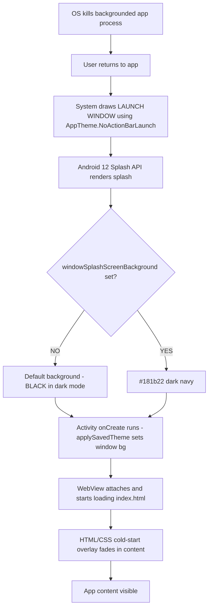

# Native Launch Pipeline Audit — Black Frame on Cold Start

**Date:** 2026-08-07
**Build under analysis:** v1145
**Scope:** Android native launch sequence (themes, SplashScreen API, Capacitor config, Activity lifecycle)
**Author:** Architect mode diagnostic audit

---

## 1. Executive Summary

The black frame the user sees after a long background period (Android process death → activity recreation) is **not caused by the web layer** (index.html / app.js / CSS). It originates from the **native Android launch window**, which is drawn by the OS **before any JavaScript executes**.

The root cause is a **misconfigured Android 12 Splash API theme** combined with the **absence of the `@capacitor/splash-screen` plugin**. The native splash window renders with a default (often black) background because the correct attribute (`windowSplashScreenBackground`) is never set, and there is no native plugin to control or hide the splash smoothly.

**Conclusion:** The HTML/CSS cold-start fade overlay (build v1145) can only smooth the transition *after* the WebView renders. It **cannot** cover the first native frame. A native fix in `styles.xml` is required.

---

## 2. Evidence — File-by-File Findings

### 2.1 `android/app/src/main/AndroidManifest.xml` (lines 9–17)

```xml
<application
    android:theme="@style/AppTheme">
    <activity
        android:name=".MainActivity"
        android:theme="@style/AppTheme.NoActionBarLaunch"
        android:launchMode="singleTask"
        ...>
```

- The **launch activity** (`MainActivity`) uses `@style/AppTheme.NoActionBarLaunch`.
- `launchMode="singleTask"` — on process death, the system recreates this activity and re-draws its launch theme.

### 2.2 `android/app/src/main/res/values/styles.xml` (complete file)

```xml
<style name="AppTheme" parent="Theme.AppCompat.DayNight.NoActionBar">
    <item name="colorPrimary">@color/colorPrimary</item>
    <item name="colorPrimaryDark">@color/colorPrimaryDark</item>
    <item name="colorAccent">@color/colorAccent</item>
    <item name="android:windowBackground">@color/app_background</item>
    <item name="android:windowDisablePreview">true</item>
</style>

<style name="AppTheme.NoActionBarLaunch" parent="Theme.SplashScreen">
    <item name="android:background">@color/app_background</item>
    <item name="windowSplashScreenAnimatedIcon">@android:color/transparent</item>
</style>
```

**Critical issues:**

| Attribute | Present? | Correct for Android 12+? |
|---|---|---|
| `android:background` | ✅ (line 15) | ❌ **No** — does NOT control the Android 12 splash background |
| `windowSplashScreenBackground` | ❌ **MISSING** | ❌ — this is the attribute that controls the splash background on Android 12+ |
| `windowSplashScreenAnimatedIcon` | ✅ transparent (line 16) | ⚠️ Transparent → no icon shown, just a solid background |
| `windowSplashScreenAnimationDuration` | ❌ missing | — |
| `postSplashScreenTheme` | ❌ **MISSING** | ❌ — needed for seamless splash → activity transition |

**Why `android:background` is wrong:** On Android 12+ (API 31+), the system splash screen is rendered by the OS using `windowSplashScreen*` attributes. The `android:background` item on a `Theme.SplashScreen` parent does **not** set the splash background color. Without `windowSplashScreenBackground`, the OS falls back to a default (in dark mode, typically black or a system default). This is the black frame.

### 2.3 `android/app/src/main/res/values/colors.xml`

```xml
<color name="app_background">#181b22</color>
<color name="colorPrimary">#181b22</color>
<color name="colorPrimaryDark">#0f1115</color>
<color name="colorAccent">#6C63FF</color>
```

- `app_background` = `#181b22` (dark navy) — correct target color, but **not wired** to the Android 12 splash background.

### 2.4 `android/app/src/main/res/values-night/colors.xml`

- Mirrors `values/colors.xml` with the same `#181b22`. No override issue.

### 2.5 `android/app/src/main/java/com/budgetassistant/app/MainActivity.java`

```java
protected void onCreate(Bundle savedInstanceState) {
    super.onCreate(savedInstanceState);
    registerPlugin(NativeThemePlugin.class);
    registerPlugin(SecurityPlugin.class);
    ...
    applySavedTheme();   // sets window background + WebView bg
    applySecureMode();
}
```

- `applySavedTheme()` sets `window.setBackgroundDrawable(#181b22)` and WebView background **after** the splash window is already drawn. It cannot affect the first native frame.
- `onResume()` only re-applies secure mode (deliberately skips background re-application to avoid surface flicker).

### 2.6 `capacitor.config.json` (lines 15–20)

```json
"plugins": {
    "SplashScreen": {
        "launchAutoHide": true,
        "backgroundColor": "#181b22",
        "launchShowDuration": 0
    },
    ...
}
```

**This config is INERT.** The `@capacitor/splash-screen` plugin is **not installed** (see §2.7). No native code reads these values.

### 2.7 Plugin inventory — `@capacitor/splash-screen` is ABSENT

**From `package.json` dependencies:**
```
@capacitor-community/privacy-screen
@capacitor/android
@capacitor/app
@capacitor/browser
@capacitor/core
@capacitor/filesystem
@capacitor/keyboard
@capacitor/local-notifications
@capacitor/share
@capgo/capacitor-native-biometric
@capgo/capacitor-updater
```
→ **No `@capacitor/splash-screen`.**

**From the v1145 build output (9 Android plugins discovered by `npx cap sync`):**
```
@capacitor-community/privacy-screen
@capacitor/app
@capacitor/browser
@capacitor/filesystem
@capacitor/keyboard
@capacitor/local-notifications
@capacitor/share
@capgo/capacitor-native-biometric
@capgo/capacitor-updater
```
→ **No splash-screen plugin registered.**

**From `android/app/build.gradle`:** only `androidx.core:core-splashscreen:1.0.1` is present (the AndroidX library, not the Capacitor plugin).

### 2.8 Resource directories

| Directory | Exists? | Purpose |
|---|---|---|
| `values/` | ✅ | Base theme |
| `values-night/` | ✅ | Night colors |
| `values-v31/` | ❌ **MISSING** | Android 12+ Splash API overrides |
| `values-v27/` | ❌ **MISSING** | Android 8–11 splash overrides |
| `values-v24/` | ✅ (empty) | — |
| `drawable/splash.png` | ✅ (279 KB) | **ORPHANED** — not referenced by any XML (0 search results) |

---

## 3. The Native Launch Sequence (Android 12+, cold start / process death)



**Key point:** Steps C–D (the black frame) happen **entirely in native code**, before the WebView exists. The HTML overlay (step G) cannot influence steps C–D.

---

## 4. Why the HTML/CSS Overlay (v1145) Cannot Fix This

The cold-start overlay added in build v1145:
- Lives in `index.html` → only rendered once the WebView loads the page.
- The WebView is attached to the Activity **after** the native splash window is shown.
- Therefore the overlay covers the WebView content transition, **not** the native launch window.

**The overlay is still valuable** — it smooths the WebView-content fade after the native splash dismisses — but it is **not sufficient** to eliminate the first black frame.

---

## 5. Recommended Native Fix

### 5.1 `styles.xml` — add the missing Splash API attributes

```xml
<style name="AppTheme.NoActionBarLaunch" parent="Theme.SplashScreen">
    <item name="android:background">@color/app_background</item>
    <item name="windowSplashScreenBackground">@color/app_background</item>
    <item name="windowSplashScreenAnimatedIcon">@android:color/transparent</item>
    <item name="postSplashScreenTheme">@style/AppTheme</item>
</style>
```

- `windowSplashScreenBackground` → forces the Android 12 splash background to `#181b22` (matches the app).
- `postSplashScreenTheme` → seamless transition from splash to the main `AppTheme` (no theme-jump flash).

### 5.2 Create `values-v31/styles.xml` (Android 12+)

```xml
<style name="AppTheme.NoActionBarLaunch" parent="Theme.SplashScreen">
    <item name="windowSplashScreenBackground">@color/app_background</item>
    <item name="windowSplashScreenAnimatedIcon">@android:color/transparent</item>
    <item name="postSplashScreenTheme">@style/AppTheme</item>
</style>
```

### 5.3 Create `values-v27/styles.xml` (Android 8–11, pre-Splash API)

```xml
<style name="AppTheme.NoActionBarLaunch" parent="Theme.AppCompat.Light.NoActionBar">
    <item name="android:windowBackground">@drawable/splash</item>
</style>
```

- Uses the existing (currently orphaned) `drawable/splash.png` as the pre-12 splash background.

### 5.4 (Optional) Install `@capacitor/splash-screen`

For full programmatic control (JS-driven hide, fade timing), install the plugin:
```
npm install @capacitor/splash-screen
npx cap sync android
```
This would make the `SplashScreen` config in `capacitor.config.json` actually take effect.

---

## 6. Impact Assessment

| Change | Risk | Benefit |
|---|---|---|
| Add `windowSplashScreenBackground` | Low | Eliminates black splash background on Android 12+ |
| Add `postSplashScreenTheme` | Low | Seamless splash → activity transition |
| Add `values-v31` | Low | Correct Android 12+ behavior |
| Add `values-v27` | Low | Correct pre-12 behavior using existing splash.png |
| Install splash-screen plugin | Medium (new dep) | Full control; optional |

**Expected outcome:** The first native frame becomes `#181b22` (dark navy) instead of black, matching the app theme. Combined with the existing HTML fade-in, the cold start becomes a smooth, seamless experience.

---

## 7. Open Questions / Decisions

1. **Install `@capacitor/splash-screen`?** Recommended for full control, but adds a dependency. The theme-only fix may be sufficient.
2. **Splash icon:** Keep transparent, or use the app icon (`@mipmap/ic_launcher`)? Transparent keeps it minimal; an icon adds brand recognition.
3. **Pre-12 devices (API < 31):** Are they still supported? The `values-v27` fix uses the orphaned `splash.png`.
