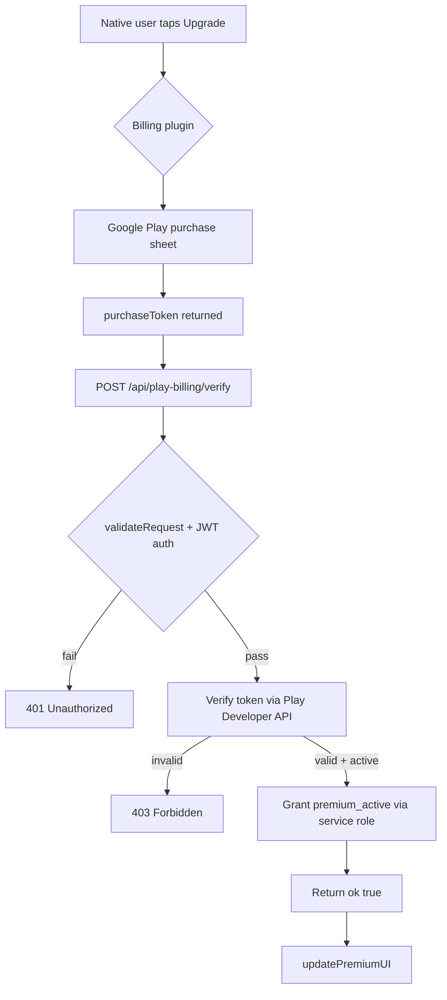

# Phase 2.1 — Google Play Billing (Native Premium) Implementation Plan

## 1. Objective

Enable native Android premium purchases via **Google Play Billing**, so that the Android app (Capacitor) can sell the same premium subscription that the web/PWA currently sells via Stripe. This closes the gap where `restorePremiumPurchase()` on native currently returns *"Η επαναφορά δεν είναι ακόμα διαθέσιμη."* (not available yet).

The design follows the **two-payment-flow architecture** already documented in [`plans/premium-subscription-design.md`](plans/premium-subscription-design.md): `premium_active` in the `profiles` table remains the single source of truth for entitlement, regardless of which payment channel (Stripe web or Play Billing native) granted it.

---

## 2. Architecture Overview

```
┌─────────────────────────── Android App (Capacitor) ───────────────────────────┐
│                                                                               │
│  app.js  startPremiumPurchase() / restorePremiumPurchase()                    │
│     │                                                                         │
│     ▼                                                                         │
│  @capacitor-community/billing  (Play Billing client)                          │
│     │  purchase() / getPurchases() / restorePurchases()                       │
│     ▼                                                                         │
│  Google Play Store  ──►  purchase token + productId                           │
└──────────────────────────────┬────────────────────────────────────────────────┘
                               │  POST /api/play-billing/verify
                               │  { purchaseToken, productId, subscriptionId }
                               ▼
┌────────────────────── Cloudflare Pages Function ──────────────────────────────┐
│  functions/api/play-billing.js                                                │
│    1. validateRequest() + JWT auth (same as purchase.js)                      │
│    2. Verify purchaseToken via Google Play Developer API                      │
│       (service account JWT → access token → purchases.subscriptions.get)      │
│    3. On valid + active → grant entitlement                                   │
│       (SUPABASE_SERVICE_ROLE_KEY → profiles.premium_active = true)            │
└───────────────────────────────────────────────────────────────────────────────┘
```

### Key design decisions

1. **Server-side verification is mandatory.** The purchase token returned by Play Billing must be verified against the Google Play Developer API on the server before granting entitlement. This prevents client-side spoofing (the same reason Stripe webhooks are verified server-side).

2. **`premium_active` stays the single source of truth.** Both Stripe (web) and Play Billing (native) write to the same `profiles.premium_active` column. The existing `isPremium()` / `requirePremium()` gating in [`app.js`](app.js:511) works unchanged.

3. **Reuse the existing auth + security pattern.** The new endpoint mirrors [`functions/api/purchase.js`](functions/api/purchase.js) and [`functions/api/premium-status.js`](functions/api/premium-status.js): `validateRequest()`, JWT verification via `/auth/v1/user`, and `SUPABASE_SERVICE_ROLE_KEY` for entitlement writes.

4. **No new DB columns.** Play Billing entitlement reuses `premium_active` and `premium_purchased_at`. Optionally we can record the purchase source, but it is not required for functionality.

---

## 3. Prerequisites (external, user must complete)

These are **manual Google Play Console / Cloudflare steps** that cannot be automated from this repo. The implementation cannot be fully tested until they are done.

| # | Prerequisite | Where | Notes |
|---|--------------|-------|-------|
| P1 | **Google Play Console account** with the app published (or at least an internal test track) | play.google.com/console | App must exist to create in-app products |
| P2 | **In-app product / subscription configured** (e.g. `premium_monthly`) | Play Console → Monetize → Products | Record the exact product ID |
| P3 | **Google Play Developer API enabled** for the Cloud project | Google Cloud Console | Link the Play Console app to a Cloud project |
| P4 | **Service account JSON credentials** created | Google Cloud Console → IAM → Service Accounts | Create key, download JSON |
| P5 | **Service account granted access** to the app in Play Console | Play Console → Users & permissions | Grant "View financial data" + "Manage orders" |
| P6 | **License testing** (optional but recommended) | Play Console → License testing | Add tester Gmail accounts for free test purchases |
| P7 | **Cloudflare Pages secret** `GOOGLE_SERVICE_ACCOUNT_JSON` | Cloudflare Pages → Settings → Environment variables | Paste the service account JSON |
| P8 | **Cloudflare Pages secret** `PLAY_PACKAGE_NAME` | Cloudflare Pages → Settings → Environment variables | e.g. `com.budgetassistant.app` |

> **Note:** The service account JSON is a sensitive credential. It must be stored as a Cloudflare Pages **secret** (encrypted), never committed to the repo. The repo will only contain the env var name reference.

---

## 4. Files to Create

### 4.1 `functions/api/play-billing.js` (NEW)

A Cloudflare Pages Function that verifies a Play Billing purchase token and grants entitlement.

**Request:** `POST /api/play-billing/verify`
```json
{
  "purchaseToken": "string (from Play Billing)",
  "productId": "string (e.g. premium_monthly)",
  "subscriptionId": "string (optional, for subscriptions)"
}
```

**Response (success):**
```json
{ "ok": true, "premium_active": true }
```

**Response (error):** `{ "error": "..." }` with appropriate HTTP status.

**Implementation outline:**

1. `onRequestOptions` — CORS preflight (mirror [`purchase.js`](functions/api/purchase.js:15)).
2. `onRequestPost`:
   - Check `GOOGLE_SERVICE_ACCOUNT_JSON` and `SUPABASE_SERVICE_ROLE_KEY` are configured (mirror [`purchase.js`](functions/api/purchase.js:41)).
   - `validateRequest(request)` for body size / content type.
   - Parse body; require `purchaseToken` and `productId`.
   - Verify JWT via `POST {supabaseUrl}/auth/v1/user` with `Authorization: Bearer <token>` (mirror [`purchase.js`](functions/api/purchase.js:61)). Extract `user.id`.
   - **Verify the purchase token** against Google Play Developer API:
     - Build a JWT signed with the service account private key (RS256), scoped to `https://www.googleapis.com/auth/androidpublisher`.
     - Exchange JWT for an access token via Google OAuth2 token endpoint.
     - Call `GET https://androidpublisher.googleapis.com/androidpublisher/v3/applications/{packageName}/purchases/subscriptions/{subscriptionId}/tokens/{purchaseToken}` (for subscriptions) or the products endpoint (for one-time).
     - Check the response `paymentState` / `expiryTimeMillis` / `autoRenewing` to confirm the purchase is active and not refunded.
   - **Grant entitlement** if verified: `PATCH {supabaseUrl}/rest/v1/profiles?id=eq.{userId}` with `{ premium_active: true, premium_purchased_at: <now> }` using `SUPABASE_SERVICE_ROLE_KEY` (mirror [`premium-status.js`](functions/api/premium-status.js:188)).
   - Return `{ ok: true, premium_active: true }`.

> **Note on JWT signing in Workers:** Cloudflare Workers do not have Node's `crypto`/`jsonwebtoken` by default. The plan should use the **Web Crypto API** (`crypto.subtle`) to sign the RS256 JWT, or use a lightweight pure-JS JWT helper. This is a key implementation detail to flag.

---

## 5. Files to Modify

### 5.1 `package.json` (MODIFY)

Add the Capacitor billing plugin dependency:
```json
"dependencies": {
  "@capacitor-community/billing": "^4.0.0"
}
```
Then run `npm install`.

### 5.2 `android/app/build.gradle` (MODIFY — auto-generated)

After `npm install` + `npx cap sync`, the billing plugin will be registered automatically in `android/app/capacitor.build.gradle` and `android/capacitor.settings.gradle`. No manual Gradle edit should be needed for the plugin itself.

### 5.3 `app.js` (MODIFY)

**`startPremiumPurchase()`** ([`app.js`](app.js:11880)) — branch on native vs web:
- If `window.Capacitor` is present (native), call the billing plugin:
  ```js
  const { Billing } = window.Capacitor.Plugins;
  await Billing.connect();
  const result = await Billing.purchase({ productId: 'premium_monthly' });
  // On success, call /api/play-billing/verify with the returned purchaseToken
  ```
- Else, keep the existing Stripe Checkout flow.

**`restorePremiumPurchase()`** ([`app.js`](app.js:11949)) — replace the "not available yet" branch:
- On native, call `Billing.restorePurchases()` (or `getPurchases()`), then verify each active purchase via `/api/play-billing/verify`, then call `reconcilePremiumPurchase()`.
- On web, keep the existing `reconcilePremiumPurchase()` flow.

**New helper** `verifyPlayBillingPurchase(purchaseToken, productId)`:
- `fetch('/api/play-billing/verify', { method: 'POST', headers: { Authorization: Bearer <session> }, body: JSON.stringify({...}) })`.
- On `{ ok: true }`, update local premium state and call `updatePremiumUI()`.

### 5.4 `index.html` (MODIFY — if needed)

No changes expected unless the premium modal needs a native-specific label. Optional: add a note in the premium modal that native purchases are handled by Google Play.

### 5.5 `plans/completion-roadmap.md` (MODIFY)

Mark Phase 2.1 as complete once implemented and verified.

---

## 6. Implementation Steps (execution order)

1. **Install billing plugin** — `npm install @capacitor-community/billing`, then `npx cap sync android`.
2. **Create `functions/api/play-billing.js`** — implement the verify endpoint per Section 4.1.
3. **Add Cloudflare secrets** — `GOOGLE_SERVICE_ACCOUNT_JSON` and `PLAY_PACKAGE_NAME` (requires P7/P8).
4. **Modify `app.js`** — branch `startPremiumPurchase()` and `restorePremiumPurchase()` on native; add `verifyPlayBillingPurchase()` helper.
5. **Mirror to `www/`** — run `node scripts/version-sync.js` to copy `app.js` changes to `www/`.
6. **Run `version-check.js`** — confirm parity PASS.
7. **Build & test on device** — `npx cap run android` with a license tester account (requires P1–P6).
8. **Update roadmap** — mark Phase 2.1 complete.

---

## 7. Verification / Acceptance Criteria

- [ ] `node scripts/version-check.js` passes after changes.
- [ ] On native, tapping "Upgrade to Premium" opens the Google Play purchase sheet (not Stripe).
- [ ] A test purchase via a license tester account sets `profiles.premium_active = true` in Supabase.
- [ ] `restorePremiumPurchase()` on native successfully restores an existing Play purchase and re-grants entitlement.
- [ ] Web/PWA Stripe flow is **unaffected** (regression check).
- [ ] Unauthorized / spoofed purchase tokens are rejected by `/api/play-billing/verify`.

---

## 8. Risks & Open Questions

| Risk / Question | Impact | Mitigation |
|-----------------|--------|------------|
| **JWT signing in Workers** (RS256) | High — core of token verification | Use Web Crypto `crypto.subtle`; verify with a test token before wiring the full flow |
| **Play Console not yet configured** (P1–P6) | Blocks end-to-end testing | Implementation can be written + unit-tested, but device test requires prerequisites |
| **Plugin API differences** (`@capacitor-community/billing` v4 vs v5) | Medium | Pin version; verify method names against installed plugin docs |
| **Subscription vs one-time product** | Medium | Decide product type first; verification endpoint differs (subscriptions vs products) |
| **Refund / cancellation handling** | Medium | Check `paymentState` and `expiryTimeMillis`; do not grant if refunded/expired |
| **Duplicate entitlement writes** | Low | `premium_active` is idempotent; safe to re-grant |

---

## 9. Out of Scope (this phase)

- Play Store listing / release upload (Phase 4).
- Stripe flow changes (already working).
- Phase 3.1 duplicate-code audit (separately deferred).
- Refund webhooks from Google Play (can be added later; not required for initial entitlement grant).

---

## 10. Mermaid Flow



---

## 11. Summary

This plan adds native Google Play Billing as a second premium payment channel while keeping `premium_active` as the single source of truth. The core work is: (1) install the Capacitor billing plugin, (2) create a server-side verification endpoint `functions/api/play-billing.js`, and (3) branch the native purchase/restore paths in `app.js`. External prerequisites (Play Console product, service account credentials, Cloudflare secrets) are required before end-to-end device testing.
