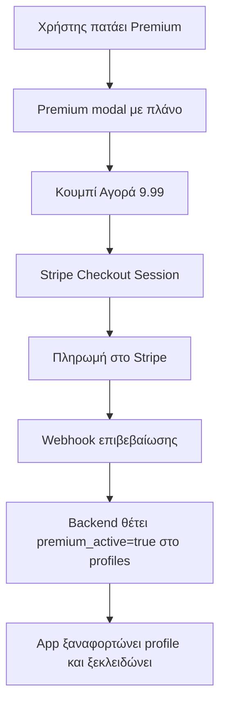

# Σχεδίαση Premium Lifetime — Budget Assistant (Βελτιωμένο Πλάνο)

> **Σκοπός:** Αξιολόγηση του πλάνου του ChatGPT και παραγωγή ενός **βελτιωμένου, βασισμένου στον πραγματικό κώδικα** πλάνου. Κάθε πρόταση εδώ αντιστοιχίζεται σε συγκεκριμένο αρχείο/συνάρτηση που **ήδη υπάρχει** στην εφαρμογή, ώστε η υλοποίηση να μην βασίζεται σε υποθέσεις.

---

## 0. Συμπέρασμα για το πλάνο του ChatGPT

Το πλάνο του ChatGPT είναι **αρχιτεκτονικά σωστό** σε γενικές γραμμές — σωστά τονίζει:
- ✅ **Account-based entitlement** (όχι μόνο localStorage) — σωστό.
- ✅ **Server-side enforcement** — σωστό, το UI-only gating δεν είναι ασφάλεια.
- ✅ **ID-based deduplication** — σωστό, και ήδη υλοποιημένο στο [`mergeAndDeduplicateTransactions()`](app.js:4316).
- ✅ **Αρχή "ο χρήστης μπορεί να χάσει πρόσβαση σε feature, ποτέ στα δεδομένα του"** — σωστή και κρίσιμη.
- ✅ **Phased implementation** — σωστό.

**Τι λείπει / τι είναι λάθος στο πλάνο του ChatGPT** (βάσει του πραγματικού κώδικα):

| # | Πρόβλημα στο πλάνο ChatGPT | Πραγματικότητα στον κώδικα |
|---|---|---|
| 1 | Αντιμετωπίζει το sync queue ως κάτι που πρέπει να χτιστεί | **Ήδη υπάρχει**: [`money_manager_sync_queue`](app.js:21040) + [`processSyncQueue()`](app.js:21083). Το όριο cloud μπαίνει εδώ, δεν χτίζεται από το μηδέν. |
| 2 | Δεν προσδιορίζει πού μπαίνει το όριο μελών | Πρέπει να μπει **server-side** στο RPC [`join_family_group()`](family-budget-migration.sql:281) και client-side στο [`inviteMemberByEmail()`](app.js:20511). |
| 3 | Δεν αναφέρει ότι το AI Coach έχει **offline fallback** | Το [`AIEngine.js`](js/AIEngine.js:2) πέφτει σε τοπικό NLP όταν το online αποτύχει. Το gating πρέπει να μετράει **μόνο τα online calls** (αυτά κοστίζουν). |
| 4 | Δεν αναφέρει το **rate limiting** που ήδη υπάρχει | [`_security.js`](functions/api/_security.js:41) έχει 30 req/min/IP. Το AI usage tracking πρέπει να συνεργαστεί με αυτό, όχι να το αγνοήσει. |
| 5 | Δεν διαχωρίζει **web (Stripe) vs Android (Play Billing)** | Η εφαρμογή είναι PWA + Capacitor Android. Χρειάζονται **δύο** ροές πληρωμής. |
| 6 | Δεν ορίζει πώς αποθηκεύεται το entitlement στη βάση | Χρειάζεται νέο πεδίο στο `profiles` (π.χ. `premium_until` / `premium_active`). |

---

## 1. Πού μπαίνει στην εφαρμογή

### Πρωτεύον σημείο: Σειρά "⭐ Premium" στο Settings Hub
Το Settings Hub βρίσκεται στο [`index.html`](index.html:841). Προσθήκη νέας **highlighted κάρτας** στην κορυφή (πάνω από τις Προτιμήσεις), με χρυσό accent.

### Δευτερεύοντα σημεία εισόδου (upgrade modals)
1. **AI Coach** — όταν ο χρήστης φτάσει το δωρεάν όριο ερωτήσεων → modal αναβάθμισης.
2. **Family** — όταν προσπαθεί να προσθέσει 3ο μέλος → modal αναβάθμισης.
3. **Multi-Currency** — όταν προσπαθεί να προσθέσει 2ο νόμισμα → modal αναβάθμισης.
4. **Category Budgets** — όταν προσπαθεί να προσθέσει 3ο budget → modal αναβάθμισης.
5. **Cloud sync** — όταν ξεπεράσει το μηνιαίο όριο συναλλαγών → ειδοποίηση.

---

## 2. Το πλάνο (Lifetime εφάπαξ)

| Στοιχείο | Τιμή |
|---|---|
| Όνομα | **Premium Lifetime** |
| Τύπος | Εφάπαξ (one-time) |
| Τιμή | **9,99 €** (ρυθμίσιμη σταθερά) |
| Διάρκεια | Δια βίου |
| Ανανέωση | Καμία |

### Πίνακας ορίων Free vs Premium

| Feature | Free | Premium Lifetime |
|---|---|---|
| Μέλη Οικογένειας | Έως **2** (εσύ + 1) | **Απεριόριστα** (3+) |
| Cloud συναλλαγές/μήνα | Έως **100** | **Απεριόριστες** |
| Νομίσματα | **1** | **Απεριόριστα** |
| Category Budgets | Έως **2** | **Απεριόριστα** |
| AI Coach (online) | Έως **10 ερωτήσεις/μήνα** | Έως **50/μήνα** (fair-use, ΟΧΙ απεριόριστο) |

> **Σημείωση AI:** Το online AI (Gemini) κοστίζει ανά κλήση. Ακόμα και στο Premium, το "απεριόριστο" AI θα μπορούσε να γίνει κατάχρηση. Γι' αυτό το Premium έχει **fair-use όριο 50/μήνα**, όχι απεριόριστο. Το **offline AI** (τοπικό NLP) παραμένει **δωρεάν και απεριόριστο για όλους** — δεν κοστίζει τίποτα.

---

## 3. Αρχιτεκτονική — Πώς ενσωματώνεται στον πραγματικό κώδικα

### 3.1 Entitlement (βάση δεδομένων)

**Νέο πεδίο στο `profiles`** (Supabase):
```sql
ALTER TABLE public.profiles
  ADD COLUMN IF NOT EXISTS premium_active BOOLEAN DEFAULT false,
  ADD COLUMN IF NOT EXISTS premium_purchased_at TIMESTAMPTZ;
```

- Το `premium_active` είναι η **πηγή αλήθειας** (server-side).
- Το localStorage flag είναι **μόνο cache** για ταχύτερο UI (δεν είναι ασφάλεια).
- Κεντρικό helper στο [`app.js`](app.js): `isPremium()` που διαβάζει το `state.userProfile.premium_active`.

### 3.2 Πληρωμή — Δύο ροές

| Πλατφόρμα | Πάροχος | Σημειώσεις |
|---|---|---|
| **Web / PWA** | **Stripe** (Checkout) | Backend στο [`functions/`](functions/api/) — νέο endpoint `functions/api/purchase.js` + `functions/api/webhook.js` |
| **Android (Capacitor)** | **Google Play Billing** | Native plugin στο [`android/`](android/), απαραίτητο για Play Store |

**Ροή web (Stripe):**


> **MVP επιλογή:** Πριν τη Stripe ενσωμάτωση, μπορεί να γίνει **χειροκίνητη ενεργοποίηση** (admin flag) για δοκιμή της ροής gating.

### 3.3 Gating ανά feature (αντιστοίχιση σε κώδικα)

#### ① Μέλη Οικογένειας (>2 = Premium)
- **Server-side (κρίσιμο):** Στο RPC [`join_family_group()`](family-budget-migration.sql:281), πριν το UPDATE, μετράμε τα μέλη:
  ```sql
  SELECT COUNT(*) INTO member_count FROM public.profiles WHERE family_id = target_family_id;
  IF member_count >= 2 AND NOT (SELECT premium_active FROM public.profiles WHERE id = auth.uid()) THEN
      RAISE EXCEPTION 'Family limit reached. Upgrade to Premium for more members.';
  END IF;
  ```
- **Client-side (UX):** Στο [`inviteMemberByEmail()`](app.js:20511), πριν το insert, ελέγχουμε `state.familyProfiles.length >= 2 && !isPremium()` → modal αναβάθμισης.

#### ② Cloud συναλλαγές/μήνα (100 = Free)
- **Σημείο ελέγχου:** Στο [`processSyncQueue()`](app.js:21083) και στο [`syncLocalTransactionsToCloud()`](app.js:20940), πριν το batch insert.
- Μετράμε τις συναλλαγές του τρέχοντος μήνα στο cloud (`COUNT(*) WHERE user_id = ... AND created_at >= month_start`).
- Αν `>= 100 && !isPremium()` → **δεν συγχρονίζουμε**, μένουν στο `offline_transactions` (δεν χάνονται), και εμφανίζεται ειδοποίηση αναβάθμισης.
- **Κρίσιμο:** Οι συναλλαγές **δεν διαγράφονται** — μένουν τοπικά. Τηρείται η αρχή "ποτέ μην χάσεις δεδομένα".

#### ③ Multi-Currency (1 = Free)
- **Σημείο ελέγχου:** Όπου προστίθεται νόμισμα (στο [`CurrencyService.js`](js/CurrencyService.js) / settings picker).
- Αν `currencies.length >= 1 && !isPremium()` → modal αναβάθμισης.

#### ④ Category Budgets (2 = Free)
- **Σημείο ελέγχου:** Όπου προστίθεται budget (στο stats/budgets UI).
- Αν `budgets.length >= 2 && !isPremium()` → modal αναβάθμισης.

#### ⑤ AI Coach (online)
- **Σημείο ελέγχου:** Στο [`submitCoachQuery()`](app.js:25190), πριν το `OnlineAIProvider.processAdvisorQuery()`.
- **Μόνο τα online calls μετράνε** (αυτά κοστίζουν). Το offline fallback είναι δωρεάν.
- **Usage tracking:** Νέος πίνακας `ai_usage` (user_id, month, count) ή πεδίο στο `profiles`. Server-side έλεγχος στο [`coach.js`](functions/api/coach.js:27) — όχι μόνο client-side.
- Free: 10/μήνα. Premium: 50/μήνα.

---

## 4. Νέοι πίνακες / αλλαγές στη βάση

```sql
-- 1. Entitlement στο profiles
ALTER TABLE public.profiles
  ADD COLUMN IF NOT EXISTS premium_active BOOLEAN DEFAULT false,
  ADD COLUMN IF NOT EXISTS premium_purchased_at TIMESTAMPTZ;

-- 2. AI usage tracking (για fair-use)
CREATE TABLE IF NOT EXISTS public.ai_usage (
    id UUID PRIMARY KEY DEFAULT gen_random_uuid(),
    user_id UUID NOT NULL REFERENCES auth.users(id) ON DELETE CASCADE,
    usage_month TEXT NOT NULL,          -- 'YYYY-MM'
    call_count INT DEFAULT 0,
    UNIQUE (user_id, usage_month)
);
```

> **Σημείωση RLS:** Ο νέος πίνακας `ai_usage` πρέπει να έχει RLS με tenant isolation (όπως τα υπόλοιπα). Το `premium_active` διαβάζεται από το `profiles` που ήδη έχει RLS.

---

## 5. Νέοι / τροποποιημένοι endpoints

| Αρχείο | Αλλαγή |
|---|---|
| [`functions/api/purchase.js`](functions/api/) | **ΝΕΟ** — Δημιουργεί Stripe Checkout Session |
| [`functions/api/webhook.js`](functions/api/) | **ΝΕΟ** — Επιβεβαιώνει πληρωμή, θέτει `premium_active=true` |
| [`functions/api/coach.js`](functions/api/coach.js:27) | **Τροποποίηση** — Έλεγχος `ai_usage` πριν την κλήση Gemini |
| [`functions/api/ai.js`](functions/api/ai.js:27) | **Τροποποίηση** — Έλεγχος `ai_usage` (extract mode) |
| [`functions/api/_security.js`](functions/api/_security.js:41) | **Επαναχρησιμοποίηση** — Τα νέα endpoints χρησιμοποιούν το ίδιο rate limiting |

---

## 6. Βήματα υλοποίησης (phased)

### Φάση 1 — Entitlement & βάση
1. SQL migration: `premium_active` στο `profiles` + πίνακας `ai_usage` + RLS.
2. Κεντρικό helper `isPremium()` στο [`app.js`](app.js) + φόρτωση από `state.userProfile`.
3. Σειρά "⭐ Premium" στο Settings Hub ([`index.html`](index.html:841)) + Premium modal.

### Φάση 2 — Gating (χωρίς πληρωμή, χειροκίνητο flag)
4. Gating Family: server-side στο [`join_family_group()`](family-budget-migration.sql:281) + client-side στο [`inviteMemberByEmail()`](app.js:20511).
5. Gating Cloud συναλλαγών: στο [`processSyncQueue()`](app.js:21083) / [`syncLocalTransactionsToCloud()`](app.js:20940).
6. Gating Multi-Currency: στο [`CurrencyService.js`](js/CurrencyService.js).
7. Gating Category Budgets: στο stats/budgets UI.
8. Gating AI Coach: `ai_usage` tracking + έλεγχος στο [`submitCoachQuery()`](app.js:25190) και [`coach.js`](functions/api/coach.js:27).

### Φάση 3 — Πληρωμή
9. **Web:** Stripe Checkout + webhook ([`functions/api/purchase.js`](functions/api/), [`webhook.js`](functions/api/)).
10. **Android:** Google Play Billing (Capacitor plugin στο [`android/`](android/)) + restore purchases.
11. Σύνδεση πληρωμής → `premium_active=true`.

### Φάση 4 — i18n & δοκιμές
12. Ελληνικά + Αγγλικά κείμενα για όλο το premium UI.
13. Δοκιμές: ροή πληρωμής, gating (μέλη/cloud/νόμισμα/budgets/AI), restore, offline.

---

## 7. Ανοιχτά ερωτήματα (για επιβεβαίωση)

- ✅ **Premium features:** Οικογένεια >2 + Cloud όριο + Multi-Currency + Budgets + AI Coach (επιβεβαιωμένα).
- **Τιμή:** 9,99 € εφάπαξ (επιβεβαίωση).
- **Cloud όριο:** 100 συναλλαγές/μήνα (επιβεβαίωση).
- **AI όρια:** Free 10/μήνα, Premium 50/μήνα (επιβεβαίωση).
- **Πάροχος πληρωμής:** Stripe (web) + Play Billing (Android) — ή χειροκίνητο flag για MVP πρώτα;
- **Ποιος πληρώνει:** Ο admin της οικογένειας; Το premium είναι ανά-λογαριασμό (όχι ανά-οικογένεια) — επιβεβαίωση.

---

## 8. Κρίσιμη αρχή (από το ChatGPT, σωστή)

> **"Ο χρήστης μπορεί να χάσει πρόσβαση σε ένα feature, αλλά ΠΟΤΕ στα δεδομένα του."**

Αυτό σημαίνει:
- Όταν λήξει/αφαιρεθεί το premium, τα **δεδομένα μένουν** (συναλλαγές, budgets, νομίσματα, μέλη).
- Μόνο η **δημιουργία νέων** πάνω από το όριο μπλοκάρεται.
- Οι συναλλαγές πάνω από το cloud όριο **μένουν τοπικά**, δεν διαγράφονται.
