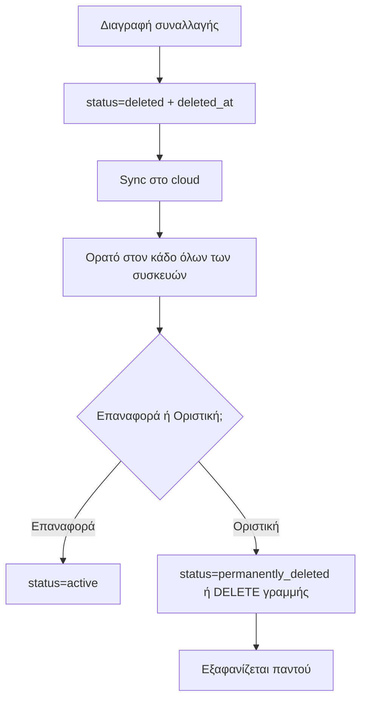

# Αρχιτεκτονικό Review του Μηχανισμού Κάδου Ανακύκλωσης

## 1. Τρέχουσα κατάσταση — Πώς λειτουργεί σήμερα

Ο κάδος έχει **δύο πηγές δεδομένων** που συγχωνεύονται:

1. **Τοπικός κάδος** (`state.trashTransactions`, localStorage `deleted_transactions_trash`)
   - Γεμίζει όταν διαγράφεις συναλλαγή ([`deleteTransaction()`](app.js:5301)).
   - Περιορίζεται σε 100 items (slice).

2. **Cloud πίνακας** `deleted_transactions` (Supabase)
   - Λειτουργεί ως **push-only backup** ([`saveDeletedTransactionsToSupabase()`](app.js:5161)).
   - Ξανατραβιέται σε κάθε sync μέσω [`fetchCloudTrashToLocal()`](app.js:5199) και συγχωνεύεται στον τοπικό κάδο.

Επιπλέον υπάρχουν **τρία επίπεδα "φρουρών"** για να μην επιστρέψουν διαγραμμένες συναλλαγές:

- **Guard 1/2:** `_deletingTxIds` + `_recentlyDeletedTxIds` (30s) — προστασία από race στο `loadData()`.
- **Guard 3:** τα IDs που είναι ήδη στον τοπικό κάδο ([`mergeAndDeduplicateTransactions()`](app.js:703)).
- **Guard 3b:** **local tombstones** `permanently_deleted_trash_ids` ([`_markPermanentlyDeleted()`](app.js:678)) — για οριστικές διαγραφές.
- **Guard 4:** sync queue pending deletes.

Και **δύο μηχανισμοί οριστικής διαγραφής**:
- [`emptyTrashBin()`](app.js:25408) — διαγράφει όλες τις γραμμές από το cloud με scoped delete (user+family+partner).
- [`deleteSingleTrashItem()`](app.js:26711) — διαγράφει μία γραμμή από το cloud.

---

## 2. Ποιος είναι ο πραγματικός ρόλος του `deleted_transactions`;

**Σήμερα είναι ταυτόχρονα backup ΚΑΙ μηχανισμός συγχρονισμού — αλλά όχι source of truth.**

| Ρόλος | Ισχύει; | Σχόλιο |
|-------|---------|--------|
| Backup | ✅ | Αποθηκεύει πλήρες αντίγραφο της διαγραμμένης συναλλαγής. |
| Μηχανισμός συγχρονισμού | ⚠️ Μερικώς | Χρησιμοποιείται για να "μοιράζει" τον κάδο σε πολλές συσκευές, αλλά με push-only + re-pull, όχι ως πραγματικό sync. |
| Source of truth | ❌ | Η αλήθεια για το τι είναι "οριστικά διαγραμμένο" βρίσκεται στα **local tombstones**, όχι στο cloud. |

**Το βασικό αρχιτεκτονικό πρόβλημα:** το cloud `deleted_transactions` είναι **push-only backup** που ξανατραβιέται, ενώ η πληροφορία "αυτό διαγράφηκε ΟΡΙΣΤΙΚΑ" ζει **μόνο στο localStorage κάθε συσκευής**. Αυτή η ασυμμετρία είναι που προκαλεί την επανεμφάνιση.

---

## 3. Αν το cloud είναι source of truth, χρειάζονται ακόμη local tombstones;

**Όχι — και αυτό είναι το κλειδί της απλοποίησης.**

Αν το cloud γίνει η πραγματική πηγή αλήθειας για τον κάδο, τότε:

- **Η οριστική διαγραφή** = διαγραφή της γραμμής από το `deleted_transactions` (ή σήμανση `permanently_deleted=true`). Αυτό είναι **ήδη** το σωστό μοντέλο.
- **Τα local tombstones γίνονται περιττά**, γιατί η αλήθεια "πού είναι διαγραμμένο" βρίσκεται στο cloud, όχι στη συσκευή.

Τα local tombstones υπάρχουν **μόνο ως workaround** για το γεγονός ότι η cloud διαγραφή μπορεί να αποτύχει (offline) και ότι το re-pull δεν έχει τρόπο να ξέρει τι διαγράφηκε οριστικά. Αν το cloud κρατάει την κατάσταση, το workaround εξαφανίζεται.

> **Συμπέρασμα:** Τα local tombstones είναι **σύμπτωμα** της λάθος αρχιτεκτονικής (push-only backup + re-pull), όχι αναγκαίο μέρος της λύσης.

---

## 4. Μπορεί να απλοποιηθεί όλος ο μηχανισμός αντί να προστεθεί άλλο επίπεδο;

**Ναι.** Η προσθήκη "cloud-side tombstone" ως **ξεχωριστό πίνακα** θα ήταν λάθος — θα πρόσθετε άλλο ένα επίπεδο κατάστασης. Η σωστή προσέγγιση είναι να **απλοποιηθεί το μοντέλο δεδομένων**, όχι να προστεθεί κατάσταση.

### Η βασική ιδέα: ένα μοναδικό μοντέλο "soft delete" στο cloud

Αντί για:
- `transactions` (ενεργές) + `deleted_transactions` (backup) + local tombstones + guards...

να έχουμε **ένα** πεδίο κατάστασης στη συναλλαγή:

```
transactions.status = 'active' | 'deleted' | 'permanently_deleted'
```

- **Διαγραφή** → `status='deleted'` (μένει στον κάδο, ορατό σε όλες τις συσκευές).
- **Οριστική διαγραφή** → `status='permanently_deleted'` (ή διαγραφή της γραμμής).
- **Επαναφορά** → `status='active'`.

Με αυτό το μοντέλο:
- Ο κάδος = `SELECT * FROM transactions WHERE status='deleted'`.
- Δεν χρειάζεται ξεχωριστός πίνακας `deleted_transactions`.
- Δεν χρειάζονται local tombstones.
- Δεν χρειάζονται Guards 1/2/3/3b/4 για τον κάδο.
- Το sync γίνεται με τον **ίδιο** μηχανισμό με τις ενεργές συναλλαγές (upsert + realtime).

---

## 5. Σχεδιασμός από το μηδέν (multi-device, offline, shared families)

### 5.1 Μοντέλο δεδομένων

Ένας πίνακας `transactions` με πεδίο κατάστασης:

```
transactions (
  id uuid PK,
  ... (υπόλοιπα πεδία συναλλαγής),
  status text NOT NULL DEFAULT 'active',   -- 'active' | 'deleted' | 'permanently_deleted'
  deleted_at timestamptz,                  -- πότε μπήκε στον κάδο
  deleted_by uuid,                         -- ποιος το διέγραψε (για family)
  user_id uuid,
  family_id uuid
)
```

### 5.2 Ροές



### 5.3 Offline λειτουργία

Το υπάρχον **sync queue** ([`enqueueSyncMutation`](app.js:5349)) ήδη χειρίζεται offline mutations. Με το νέο μοντέλο, η διαγραφή/επαναφορά/οριστική διαγραφή είναι **απλώς upsert του `status`** — μπαίνει στο ίδιο queue, χωρίς ειδική μεταχείριση.

### 5.4 Shared families

Το `deleted_by` + `family_id` επιτρέπει:
- Κάθε μέλος βλέπει τον κάδο της οικογένειας.
- Η οριστική διαγραφή από ένα μέλος ισχύει για όλους (γιατί είναι στο cloud).
- Δεν χρειάζονται τα περίπλοκα scoped deletes (`.or(family_id, user_id, partner_id)`).

### 5.5 Τι καταργείται

| Σημερινό | Τύχη |
|----------|------|
| Πίνακας `deleted_transactions` | ❌ Καταργείται (αντικαθίσταται από `status`) |
| Local tombstones `permanently_deleted_trash_ids` | ❌ Καταργούνται |
| `fetchCloudTrashToLocal()` | ❌ Καταργείται (ο κάδος είναι απλό query) |
| `syncLocalTrashToCloud()` | ❌ Καταργείται |
| Guards 1/2/3/3b/4 για τον κάδο | ⚠️ Μειώνονται δραστικά |
| Scoped deletes (family/partner) | ❌ Καταργούνται |

### 5.6 Κόστος μετάβασης

- **Migration:** προσθήκη `status` + `deleted_at` + `deleted_by` στον πίνακα `transactions`, μεταφορά των υπαρχόντων `deleted_transactions` rows σε `status='deleted'`.
- **Αλλαγή κώδικα:** ο κάδος γίνεται query, όχι ξεχωριστή κατάσταση.
- **Κίνδυνος:** μεσαίος, αλλά η απλοποίηση είναι μεγάλη και μόνιμη.

---

## 6. Σύνοψη / Σύσταση

1. **Το `deleted_transactions` είναι backup + ad-hoc sync, όχι source of truth** — και αυτή η ασάφεια είναι η ρίζα του προβλήματος.
2. **Τα local tombstones είναι workaround**, όχι λύση — αν το cloud γίνει source of truth, περιττεύουν.
3. **Η σωστή απλοποίηση δεν είναι "cloud tombstone table"** αλλά **ένα πεδίο `status` στη συναλλαγή** — λιγότερη κατάσταση, όχι περισσότερη.
4. **Αν ξεκινούσα από το μηδέν:** ένας πίνακας `transactions` με `status`, το ίδιο sync queue, και ο κάδος ως απλό query. Χωρίς ξεχωριστό πίνακα, χωρίς tombstones, χωρίς guards.

**Σύσταση:** Αντί να προσθέσουμε cloud-side tombstones (άλλο επίπεδο κατάστασης), να εξετάσουμε τη μετάβαση στο μοντέλο `status` — που απλοποιεί συνολικά τον κάδο και λύνει το πρόβλημα επανεμφάνισης σε όλες τις συσκευές μόνιμα.
